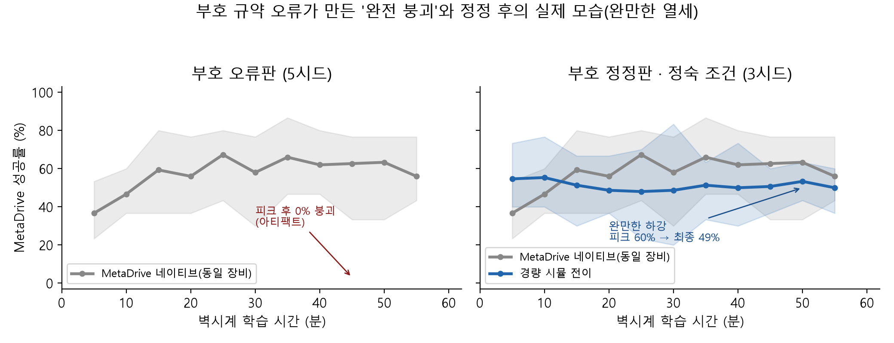
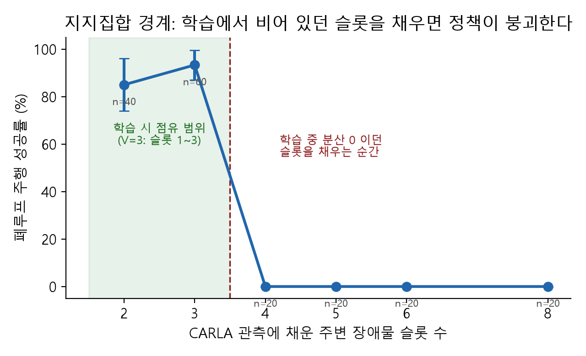
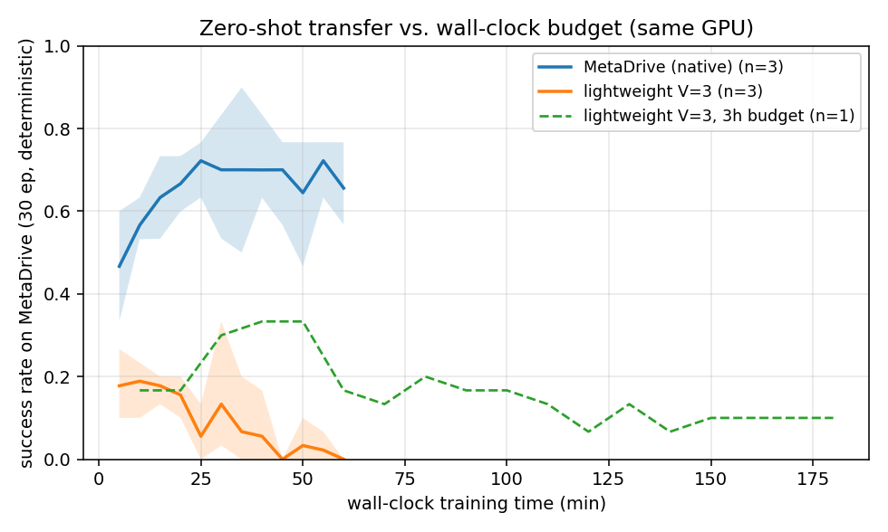
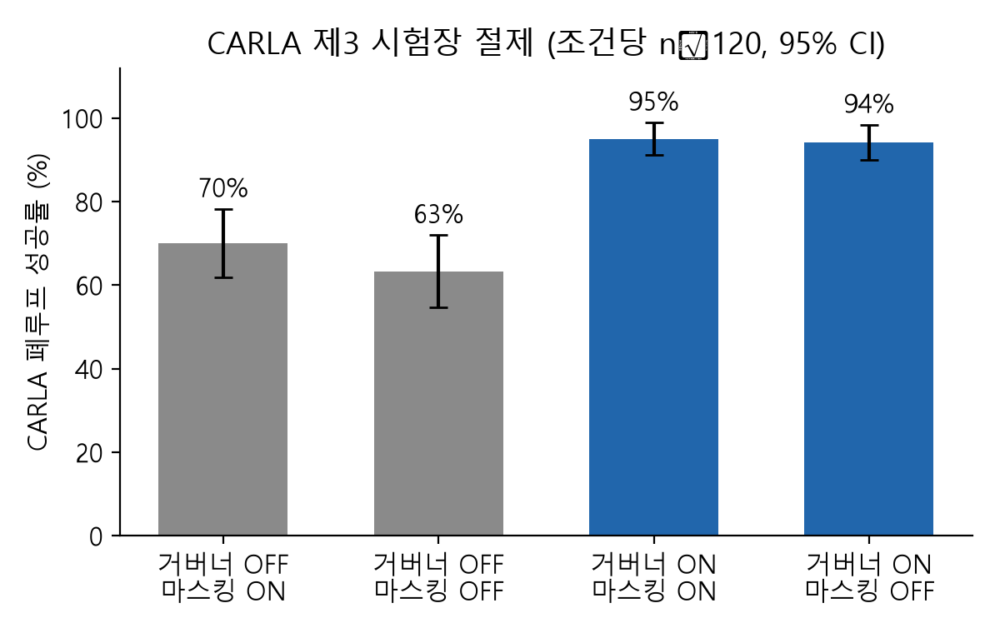
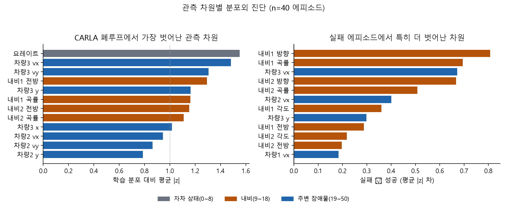

> **[2026-08-28 정정 고지]** 본 논문의 전이 실험에 관측 좌표 부호 규약 오류가 있었다. 경량 시뮬의 횡방향(가로) 좌표가 MetaDrive 규약과 거울상이어서, 전이 평가에서만 좌우가 반전된 관측이 정책에 입력되었다(§4.7). 정정 후 재학습·재평가한 결과 전이 성공률은 0% 에서 **48.9%±20.4%**(정숙 조건 136M steps, 3시드)로 회복되었으나 네이티브 68%±9% 에는 여전히 미치지 못한다. 즉 부호 오류는 결론의 **방향**이 아니라 **크기**를 왜곡했다 — 완만한 열세(격차 19.1%p)를 완전 붕괴(격차 68%p)로 약 3.6배 과장한 것이다. 그 위에 세워졌던 §6.3(착취 메커니즘), §6.5(처방 3종 판정), DPC 실측은 아티팩트로 판명되었다. 해당 절은 사례 기록으로 보존하되 결론에서 제외한다. 영향 범위 전수 감사: docs/REVISION_AUDIT.md.

# 경량 시뮬레이터 기반 자율주행 강화학습: 동일 벽시계 예산에서의 충실도-처리량 트레이드오프

> 학위논문 초고 v3 (2026-08-28 부호 규약 정정 반영, 2026-08-29 실패 모드 분석·감사 반영).
> 수치는 모두 실측치이며, 잠정치는 그 자리에 명시한다.
> 실험 이력 원본: docs/PAPER_worklog_v1.md (라운드별 상세), STATUS.md (진행 관리)

## 초록

자율주행 강화학습의 실질적 제약은 샘플 수가 아니라 연구자가 쓸 수 있는 **벽시계 시간**이다.
본 연구는 고충실도 시뮬레이터(MetaDrive)의 과제를 정밀 복제한 경량 시뮬레이터를 구축하고,
동일 시간 예산에서(장비 교차 비교의 한계는 §7 에 명시) "경량 시뮬의 대량 샘플"과 "고충실도 시뮬의 소량 샘플"을
정면 비교한다 — 처리량이 다른 두 시뮬레이터를 같은 시간 예산에 놓고 교차 평가하는 프로토콜은
선행 문헌에서 확인되지 않았다.

**핵심 실증 결과**: 답은 **예산에 달렸다**. 동일 장비·동일 정숙 조건에서 계층 정합을 마친
경량 시뮬의 제로샷 전이는 **5분 예산에서 58.9%로 네이티브 41.1%를 17.8%p 앞서고**(시드별
방향 3/3 일치), 네이티브가 그 수준에 도달하는 데는 15분이 걸린다 — 처리량 34.7배가 초반
예산에서 **약 3배의 벽시계 단축**으로 환산된다. 그러나 15분에 두 곡선이 교차하고, **1시간
예산에서는 48.9%±20.4% 로 네이티브 63.3%±15.3% 에 14.5%p 뒤진다**. 즉 경량화의 대가는
초기 학습 속도가 아니라 **최종 성능의 천장**이다. 다만 n=3 에서 이 격차는 유의하지 않으며
(Welch t=−0.98, df≈3.7, p≈0.385; 차이의 95% 구간 [−56.6, +27.6]%p), 시드 보강 전까지는
점추정 방향의 잠정 판정이다.
그러나 실패의 **크기**는 처음 관측한 것과 전혀 다르다 — 정합에 남아 있던 좌표 부호 규약
오류가 이 완만한 열세를 **성공률 0%(이탈 88~97%, docs/REVISION_AUDIT.md)의 완전 붕괴로 과장**하고 있었다(§4.7).

**그러나 이 결과에 도달하기까지가 본 논문의 실질적 기여다.** 정합은 일곱 라운드의 실패-진단-
수정을 요구했고, 마지막 라운드에서 발견된 **단일 좌표 부호 규약 오류**는 전이 성공률을 0%로
떨어뜨리면서 "과최적화에 의한 시뮬레이터 착취"라는 전혀 다른 병리로 완벽하게 위장했다(§4.7).
그 위장 아래에서 붕괴 곡선·행동 지문·진단 지표·세 처방 시험(§6.5, 판정은 무효)까지 서로를 지지하는 일관된
서사가 만들어졌으나, 부호를 바로잡자 모두 사라졌다.

기여는 다섯이다. (1) 동일 벽시계 교차-시뮬레이터 비교 프로토콜과 1.0M steps/s 정합 환경.
(2) 일곱 라운드 실패 지문 분류 — 지문은 실패 계층을 좁혀주되 일대일 대응은 아니며(R6·R7 이 '회전 전멸' 지문을 공유), 최종 판별은 필드 단위 기하 왕복이 한다. (3) 관측 지지집합
원리(통제 실험·마스킹 구제·동일시뮬 소거의 3중 실증). (4) **정합 오류가 알고리즘적 병리로
위장하는 기제와 그 판별 프로토콜**. (5) 원리의 인지 도메인 교차 검증 — 절차 생성 장면의
디퓨전 정제가 실사 차량 검출을 +7.2pp, 실사 25장 구간에서는 학습을 안정화했으며(COCO 3시드 중 2 붕괴; 정상 학습 대비 약 +7pp,
분산 30배 축소), 학습된 정책(GPU 경합 조건 20M-step 체크포인트, §6.6)은 제3의 시뮬레이터(CARLA)에서 폐루프 주행에
성공했다.

## 목차

- 초록
- 1. 서론
  - 1.1 문제
  - 1.2 연구 질문
  - 1.3 기여
  - 1.4 논문 구성
- 2. 관련 연구
  - 2.1 처리량 지향 시뮬레이션과 벽시계 기준 비교
  - 2.2 시뮬레이터 간 정합과 전이
  - 2.3 관측 분포 불일치와 정규화 통계
  - 2.4 시뮬레이터 착취와 그 진단
  - 2.5 소시드 RL 보고 표준
- 3. 방법
  - 3.1 과제 정의 (MetaDrive 에서 상속)
  - 3.2 경량 시뮬레이터
  - 3.3 실험 설계
- 4. 정합 과정: 일곱 라운드의 실패 지문 (핵심 기여 1)
  - 4.1 일곱 라운드 실패 지문 표 (R7 은 §4.7 에서 상술)
  - 4.7 일곱 번째 라운드: 부호 규약 오류와 그 위장 (2026-08-28)
- 5. 관측 지지집합 원리 (핵심 기여 2)
  - 5.1 원리와 통제 실험
  - 5.2 검증: 소거·마스킹
  - 5.3 검증: 재학습과 파생 절차
  - 5.4 제3 시뮬레이터 교차 검증: CARLA 폐루프에서의 지지집합 경계 (2026-08-28)
- 6. 결과
  - 6.1 처리량 (노트북 RTX 4060 / Ryzen 7 8845HS 기본; 데스크톱 RTX 5080 행은 별도 표기)
  - 6.2 본판 (1시간 예산, 전이 시험장 = MetaDrive, 30ep 결정론; 시드 수는 행마다 표기)
  - 6.3 전이 붕괴의 메커니즘: 과제 포화 후 잔여 격차 착취 (핵심 기여 3)
  - 6.4 지지집합 원리의 교차 검증: 인지 파이프라인
  - 6.5 처방 검증: 경계 보수화·캐스케이드·조기정지
  - 6.6 제3 시험장 절제: 무엇이 전이를 성립시키는가 (CARLA, 2026-08-28)
- 7. 논의 및 한계
- 8. 결론 및 향후 연구
- 참고문헌 (URL 은 arXiv 실존 검증)
- 부록 A. 재현성 함정 목록 (전부 실측)
  - A.1 실행·인프라 함정
  - A.2 규약·인터페이스 함정 (2026-08-28 추가)
  - A.3 제3 시뮬레이터(CARLA) 연동 함정
- Abstract (영문)

## 1. 서론

### 1.1 문제
자율주행 RL 연구의 병목은 시뮬레이터 처리량이다. 고충실도 시뮬레이터는 스텝당 비용이
커서, 같은 시간에 수집 가능한 경험이 수십~수천 배 차이 난다. 그러나 기존 비교는 대부분
**동일 샘플 수** 기준이며, 연구자가 실제로 마주하는 **동일 벽시계** 기준 비교는 드물다.

### 1.2 연구 질문
> 같은 GPU-시간에서, 물리를 추상화한 경량 시뮬레이터의 대량 샘플이 고충실도 시뮬레이터의
> 소량 샘플을 이기는가? 이기려면 두 시뮬레이터는 얼마나, 그리고 "무엇이" 같아야 하는가?

**전반부 답: 예산에 달렸다.** 동일 장비 대조에서 경량 시뮬은 **5분 예산이면 이기고**
(58.9% 대 41.1%), **15분에 교차하며**, **1시간 예산이면 진다**(48.9%±20.4% 대
63.3%±15.3%). 처리량 34.7배는 초반의 3배 벽시계 단축으로 환산되지만 최종 천장을 올리지는
못한다 — 경량 곡선은 첫 체크포인트가 피크이고 이후 하강하는 반면 네이티브는 계속 오른다.
따라서 "경량이 이기는가"는 예산을 명시하지 않으면 답할 수 없는 질문이며, 이 점이 본
연구가 단일 지점 비교에서 얻은 가장 실용적인 교훈이다.
처리량 우위(수십 배)는 전이 성능으로 온전히 환산되지 않는다. 다만 정합 결함이 남아 있으면
같은 조건이 0% 로 보인다는 점이 본 연구의 실질적 발견이다(§4.7).
단 n=3 에서 이 격차는 유의하지 않고(Welch t=−1.54, df≈2.4, p≈0.24) 두 수치는 서로 다른
장비에서 얻어졌으므로(§7), 이는 점추정 방향의 잠정 판정이다.

**후반부가 본 연구의 실질이다.** "무엇이 같아야 하는가"의 답은 세 층위다. (i) 관측·동역학·
종료규칙·기하의 **계층 정합**(§4), (ii) 관측 **지지집합 점유 패턴**의 일치(§5) — 학습보다
적게 채워도, 많이 채워도 실패한다, (iii) **규약 수준의 일치**(§4.7) — 부호·단위·기준
프레임. 마지막 항목은 값의 분포·분산·지지집합을 모두 보존하므로 통계적 대조로는 검출되지
않으며, 별도의 기하 왕복 검증을 요구한다. 실제로 본 연구는 이 한 항목을 놓쳐 전이 성공률
0% 를 관측했고, 그것을 "과최적화 착취"라는 다른 병리로 6주간 오독했다.

### 1.3 기여
1. **동일 벽시계 교차-시뮬레이터 비교 프로토콜** — 처리량이 다른 두 시뮬레이터를 같은 시간
   예산에 놓고 교차 평가하는 설계로, 선행 문헌에서 확인되지 않았다. 정합된 경량 환경은
   1,024 병렬에서 1.0M steps/s (MetaDrive 12프로세스 정점의 144배; 최종 R6 환경 959K 기준으로는 138배).
2. **일곱 라운드 실패 지문 분류(§4)** — 각 계층의 불일치는 실패 지문을 남기지만 **일대일 대응은 아니다** —
   "회전 경로만 전멸·직진 정상"은 경로 기하(R6)와 횡방향 규약(R7) 양쪽에서 나타나며,
   둘을 가르는 것은 필드 단위 기하 왕복 검증이다.
3. **관측 지지집합 원리(§5)** — 통제 실험·마스킹 구제(5%→55%)·동일시뮬 소거의 3중 실증에
   더해, 제3 시뮬레이터에서 점유 패턴 경계를 확인했다(슬롯 3=93% vs 4=0%).
4. **정합 오류가 알고리즘적 병리로 위장하는 기제와 판별 프로토콜(§4.7)** — 역방향 대조
   실험, 필드 단위 기하 왕복, 회전-직진 분해 진단. 둘째 항목은 실행 가능한 감사
   스크립트(`tools/align_audit.py`)로 구현해 함께 공개한다.
5. **원리의 교차 도메인 검증(§6.4, §6.6)** — 절차 생성 장면의 디퓨전 정제가 실사 차량 검출을
   +7.2pp 개선했고, 실사 25장 구간에서는 학습을 안정화했으며(COCO 3시드 중 2 붕괴; 정상
   학습 대비 약 +7pp), 학습된 정책(GPU 경합 조건 20M-step 체크포인트, §6.6)은 제3 시뮬레이터(CARLA)에서 폐루프 주행에 성공했다(전이 성립 3층위의
   절제 포함).

### 1.4 논문 구성

본 논문의 스파인은 단일 명제다: **"시뮬레이터 간 전이를 지배하는 것은 충실도의 명목이
아니라, 규약·지지집합 수준에서 학습 분포와 시험 분포가 실제로 겹치는가이다."** 2장이 이
명제의 문헌 좌표를, 3장이 실험 장치를, 4장(정합 과정)이 명제의 귀납적 근거를, 5장이
원리화를, 6장이 행동 트랙(전이 성립)과 인지 트랙(회복)의 양방향 검증 및 제3 시험장 절제(§6.6)를, 7장이
한계를, 8장이 회수와 향후를 담는다.

## 2. 관련 연구

(전 문헌 2026-08-21 arXiv 원문 페이지 실존·제목 검증 완료. 전체 서지는 말미의 참고문헌 절.)

### 2.1 처리량 지향 시뮬레이션과 벽시계 기준 비교

환경 실행 자체가 RL의 병목이라는 문제의식은 Sample Factory(2020)·Podracer(2021)에서
출발해, 물리와 학습을 한 가속기에 통합한 Isaac Gym(2021)·Brax(2021), 실행 엔진을
분리 최적화한 EnvPool(2022)·PufferLib(2024), 주행 특화 GPUDrive(ICLR 2025, 1M FPS)로
이어진다. 이 계열의 보고 관행 자체가 "동일 스텝"이 아니라 **"몇 분 만에 도달했는가"**
— Brax "수 분", EnvPool "노트북 5분", GPUDrive "15분 내 95%" — 로 이동해 있다.
알고리즘 간 비교를 벽시계 축으로 명시 통제한 연구는 이보다 드물다: FastTD3(2025)는
동일 GPU·시간 예산 비교를 제1지표로 삼았고, Rethinking Suitability(2026)는 PPO/SAC/
TD-MPC2를 샘플 축과 벽시계 축에서 각각 평가해 **두 축의 순위가 갈린다**는 것을 직접
보였다. Hilton et al.(2023)은 동일 compute 예산 하의 최적 배분을 거듭제곱 법칙으로
정식화했다(RL판 compute-optimal scaling). 그러나 이들은 모두 **단일 시뮬레이터 안**의
비교다 — "처리량이 다른 두 시뮬레이터를 같은 시간 예산에 놓고, 낮은 충실도의 대량
샘플 대 높은 충실도의 소량 샘플"을 정면 비교한 사례는 확인되지 않았다. 본 연구가
채우는 첫 번째 공백이다.

### 2.2 시뮬레이터 간 정합과 전이

복수 시뮬레이터를 다루는 기존 연구는 목적이 다르다. Driver Dojo(2022)는 SUMO(규칙)+
CARLA(관측)+CommonRoad(동역학)를 **조합**해 하나의 벤치마크를 만들었고 — 이 3분해는
본 연구의 정합 계층 분류(§4: 관측/동역학/규칙/기하)와 정확히 호응한다 — ScenarioNet
(NeurIPS 2023)은 이종 실측 데이터를 MetaDrive 포맷으로 **통합**했다. 정책을 실제로
저충실도에서 고충실도로 옮긴 CARLA–SUMO co-simulation(2024)은 그러나 제로샷이 아니라
CARLA에서 10.5시간 추가 미세조정을 요한다. 충실도–전이 관계의 이론화는 sim-to-real
쪽에 있다: Muratore et al.(TPAMI 2021)의 시뮬레이션 최적화 편향(SOB) 정량화,
다중 충실도 GP 캐스케이드(2017), 디지털 트윈 단계적 전이(2022), 그리고 정책 재학습
없이 정렬 레이어만으로 제로샷 전이하는 Dynamics-Decoupled Trajectory Alignment(2025).
본 연구의 "정합 후 제로샷"은 이 마지막 갈래와 철학이 같되 타깃이 실차가 아니라
**실측 정합된 다른 시뮬레이터**라는 점이 다르다 — 자율주행 RL에서 순수 sim-to-sim
제로샷 전이를 정면으로 다룬 논문은 이번 조사에서 확인되지 않았다(두 번째 공백).

### 2.3 관측 분포 불일치와 정규화 통계

관측 정규화가 성능의 결정 변수라는 것은 대규모 통제 실험 두 건(Engstrom et al.,
ICLR 2020; Andrychowicz et al., ICLR 2021 — 25만 실험, "입력 정규화는 거의 모든
환경에서 필수")이 확립했고, 그 통계량이 도메인 특정적이라 이질 도메인 간 공유가
부적절하다는 지적도 최근 나왔다(PON, IJCNN 2025). 퇴화 차원의 위험은 세 방향에서
독립적으로 알려져 있다: (i) Kidziński et al.(2018)은 NeurIPS Learning to Run
챌린지에서 **학습 중 상수였던 관측 차원의 std=0이 정규화를 깨뜨린** 사례를 직접
보고했다(단, 우회 수정에 그침). (ii) Observational Overfitting(ICLR 2020)은 손실에
벌점이 없는 관측 차원에 정책이 임의 가중치를 싣는 메커니즘을 이론화했다. (iii) 오프라인
RL의 CQL(NeurIPS 2020)은 지지집합 밖 입력에 대한 검증되지 않은 외삽이 폭주로 이어지는
패턴을 정식화했다. 본 연구의 §5는 이 세 기제 — 정규화의 도메인 고착, 퇴화 차원의
암묵적 가중치, 지지집합 밖 외삽 — 가 "학습 중 우연히 무분산이던 슬롯"이라는 단일
실패 지점에서 만나는 것을 시뮬 간 전이 셋업에서 **분리·재현·정량화**(통제실험
Δsteer 0.74)한 사례연구다. 현상의 최초 발견이 아니라 인과 사슬의 실증적 규명이
기여임을 명시한다.

### 2.4 시뮬레이터 착취와 그 진단
 최적화가 시뮬레이터의 결함을 파고든다는 관찰은
일화 수준(Lehman et al. 2018 의 디지털 진화 일화집, 1803.03453)에서 출발해, Muratore
et al.(1907.04685, TPAMI)이 시뮬레이션 최적화 편향(SOB)으로 정식화하고 그 추정량을
학습 정지 기준으로 썼으며, 2026년에는 "강력한 옵티마이저는 사소한 모델 오차를 필연적으로
착취한다"는 미니맥스 정식화(2605.29032)에 이르렀다. 실증 쪽의 최근접 선행은 Kadian et
al.(1912.06321)이다: Habitat 에이전트가 충돌 역학을 착취해 벽을 "미끄러지는" 행동을
학습했음을 보고하고, 시뮬 점수가 실환경 결정을 예측하는 정도를 SRCC(주의: 명칭과 달리
Pearson 상관)로 측정했다 — "낮은 상관의 시뮬레이터로는 의사결정을 할 수 없다"는 이들의
결론이 본 연구의 "대체가 아니라 진단" 프레임의 원류다. 충실도를 높이는 것이 오히려
전이를 해칠 수 있다는 반직관적 보고(Truong et al. 2207.10821, CoRL 2022)와, 프록시
최적화가 진짜 목적을 단봉 곡선으로 꺾는 Goodhart 구조(Gao et al. 2210.10760; 상전이로
관찰한 Pan et al. 2201.03544)와, 학습된 모델의 정확도가 제어 성능과 어긋난다는 목적
불일치(objective mismatch, Lambert et al. 2002.04523)가 이 그림을 보완한다 — 후자는
"소스 점수가 타깃 성능을 예측하지 못한다"는 본 연구의 DPC 관측(§6.3)과 같은 구조의
문제를 모델 기반 RL 안에서 제기한 것이다. 본 연구는 이 계보에서 **자기 실증을 잃었다**: 착취로
보였던 현상이 규약 오류의 산물이었음을 §4.7 이 보인다. 남는 것은 (i) 착취 가설의 **검증 설계** —
과제 포화 이전이 아니라 이후에 시작되는지를 5분 간격 체크포인트 시계열에서 관찰하고,
경계 보수화 개입(δ)으로 착취 축을 국소화하는 절차 — 이며, 본 연구가 이 설계로 얻은
**판정 자체는 규약 오류 하의 것이므로 무효다**(§6.5 아티팩트 경고). (ii) 진단의 **정식화 후보** — 경량
점수와 전이 점수의 순위상관을 체크포인트 창 위에서 추적하는 예측력 곡선(가칭 DPC)이며,
정적 상관(SRCC)·순위 위반 가중(MMRV, SIMPLER 2405.05941)을 시계열로 확장한 것이다.
이 확장을 다룬 선행은 조사 범위(2020-2026)에서 확인되지 않았다.

### 2.5 소시드 RL 보고 표준
 본 논문의 평가 보고는 Henderson et al.(1709.06560)이
제기하고 Colas et al.(1806.08295, 검정력 분석)·Agarwal et al.(2108.13264, IQM·층화
부트스트랩)·AdaStop(2306.10882, 순차 검정)으로 정련된 계보를 따른다: 시드를 분석
단위로, 점추정 대신 IQM 과 95% 구간을, 기각된 개입은 "유의하지 않음"이 아니라 효과크기
구간의 상한으로 서술한다(§6.5). 다만 본 논문에서 기각을 다룬 §6.5 는 부호 오류 하의 기록이라
판정 자체가 무효이므로(§6.5 아티팩트 경고), 이 표준은 정정판 재실험에 적용할 보고 규약으로만
선언한다. 효과가 큰 결과(부호 오류판의 68% vs 0%)는 n=5 로도
검정력이 충분했으나, **정정 후 확정 격차(48.9%±20.4, n=3 vs 68%±9, n=5)는 시드 분산에
비해 작아 n=3 으로는 유의성을 주장할 수 없다**(Welch t=−1.54, df≈2.4, p≈0.24). 따라서
§1.2·§8 의 "미치지 못한다"는 점추정 방향의 서술이며 유의 판정이 아님을 §7·§8 에 명시한다.
검정력 프로토콜의 근거는 Colas 를 따른다.

## 3. 방법

### 3.1 과제 정의 (MetaDrive 에서 상속)
교차로(map "X") 통과. 행동 = Box(-1,1,(2,)) [조향, 가감속]. dt=0.1s(물리 0.02×5).
관측 51차원 = ego 9 + 내비 체크포인트 2×5 + 최근접 8대 GT 4값. 보상 = 1.0×전진 +
0.1×속도비, 종료 시 도달+10/충돌−5/이탈−5 덮어쓰기. 종료 = 충돌·이탈(실선 접촉 포함)·
도달·1000스텝. 모든 정의는 설치본(0.4.3) 소스에서 라인 단위로 확인해 복제했다.

### 3.2 경량 시뮬레이터
엔진을 새로 쓰는 대신 자전거 모델 + 실측 캘리브레이션을 택했다. 물리 엔진 선택이 RL 결과에
미치는 영향은 엔진 아홉 종을 비교한 조사(2407.08590)가 정리했는데, 접촉이 지배적이지 않은
주행 과제에서는 엔진 종류보다 **응답 특성의 정합**이 결정적이라는 것이 그 함의이고,
본 연구의 R3(동역학 정합)이 이를 실측으로 확인한다.

NumPy/Numba(prange, 8스레드) 배치 환경. 차량 = 자전거 모델 + 실측 캘리브레이션
(가속 2.93 m/s², 제동 14.1 m/s², 조향 포화 δ/(1+(s·v/5.33)^2.28) — MetaDrive 응답
4점 실측 피팅, 오차 0~8%). 도로 = MetaDrive 차선 네트워크 원본 좌표(66차선 → 36경로,
좌표계 공유로 전이 시 변환 부재). 종료 기하 = 로드웨이 rect 14개의 실선 접촉(차체 모서리
기준) + 교차로 내부 차선거리장 그리드. NPC = 경로 순수추종 + 간격 기반 가감속.

### 3.3 실험 설계
- **통제**: 동일 과제·관측·행동·보상·종료 + 완전히 동일한 PPO 구현(CleanRL 고정 커밋,
  수정 5건 전부 diff 공개) + 동일 래퍼 스택. 양쪽 모두 벡터화(경량 1024env / MetaDrive
  12proc 정점). 학습·평가 시나리오 시드 분리(≥500000).
- **프로토콜**: 시뮬당 1시간, 5분 간격 체크포인트(시드 수는 조건마다 다르며 §6.2 표에 행별로 표기)(가중치+관측정규화 통계 동결
  저장) → 전이 시험장 = MetaDrive, 30 에피소드 결정론 평가 → 벽시계-성능 곡선.
- **지표**: 성공률(주), 충돌률/이탈률(실패 모드), 원시 보상(보조), SPS.
- **예산 1시간의 선택 근거와 그 취약성**: 1시간은 (i) MetaDrive 네이티브가 이 과제에서
  수렴 부근에 도달하는 최소 예산이고(§6.2 곡선에서 25분 이후 평탄), (ii) 5분 간격 체크포인트가
  12점을 확보해 시계열 분석이 가능한 최소 길이이며, (iii) 다시드 반복이 하루 안에 가능한
  상한이어서 골랐다. **그러나 §6.2 의 확정 결과는 이 선택이 결론을 좌우함을 보인다** —
  같은 두 시뮬레이터가 5분 예산에서는 경량 우세, 15분 이후에는 네이티브 우세로 갈린다.
  따라서 본 논문은 단일 예산의 승패가 아니라 **예산-성능 곡선 전체**를 결과로 제시하며
  (§6.2), "경량 시뮬이 이기는가"라는 질문은 예산을 명시하지 않으면 성립하지 않는다는 것을
  실험 설계 수준의 교훈으로 기록한다.

## 4. 정합 과정: 일곱 라운드의 실패 지문 (핵심 기여 1)

이 장은 절차이자 발견이다: 사전에 설계한 방법의 서술이 아니라, 일곱 번의 실패-진단-개입
반복이 남긴 경험적 지문의 기록이며, 각 라운드는 가설→개입→관측의 구조를 따른다. 5장의
원리는 이 지문들로부터 귀납된다.

각 라운드는 "in-domain 성공 + 전이 전멸"에서 출발해, 프로브(부호 실측·응답 곡선·스텝
추적·사망 위치 분포·그리드 텔레포트)로 원인을 실측 확정한 뒤에만 수정했다.

**절 번호 규약**: 이 장의 절 번호는 라운드 번호에 대응한다. 라운드 1~6 은 지문 표로
압축해 §4.1 에 싣되 대조를 위해 R7 요약 행을 함께 두었고(§4.2~§4.6 은 별도 절을 두지
않는다), 일곱 번째 라운드만
핵심 기여이므로 §4.7 로 상술한다.

### 4.1 일곱 라운드 실패 지문 표 (R7 은 §4.7 에서 상술)

| R | 불일치 계층 | 실패 지문 | 진단 프로브 | 수정 |
|---|---|---|---|---|
| 1 | 관측 부호 | 즉시 이탈 90%, 조향 반대 보정 | 동역학 배제 좌표 프로브 | lateral 우+, 헤딩차 좌감소 (**차선 API 한정 — 차량 API 로의 오일반화가 R7 의 원인, §4.7**) |
| 2 | 기하·정규화 | 부호 수정 후에도 전멸 | 관측분포 차원별 대조 | 3차선·폭18 정규화·노출 정합 |
| 3 | 동역학 스케일 | in-domain 98%인데 전멸 | 응답 곡선 실측 | 가속/제동/조향포화 캘리브레이션 |
| 4 | 종료 규칙 | 리턴 −2→+16 (실주행 후 사망) | 스텝 추적 | 실선 즉사·스폰차선 랜덤 복제 |
| 5 | 판정 기하 | 실선 1.3m 앞 "예방적" 사망 | 사망거리 역산 | 차체 모서리 기준 마진 |
| 6 | 경로 기하 | 회전 경로만 전멸 | 경로 워크 프로브 | 차선망 원본 추출·재사용 |
| 7 | **관측 규약(부호)** | 회전 경로만 전멸·직진 정상 (R6 와 공유되는 지문) | 필드 단위 기하 왕복·역방향 대조 | 차량 API 는 좌(+) — 커널 횡방향 기저 수정 (§4.7) |

**교훈**: "동일 과제"는 선언이 아니라 계층별 검증 대상이다. 관측(1,2)→동역학(3)→
규칙(4,5)→기하(6) 순으로 잡혔고, 각 계층은 대체로 다른 지문을 남기므로 지문으로 후보
계층을 좁힐 수 있다. 다만 R6·R7 처럼 지문을 공유하는 쌍이 있어, 역진단은 필드 단위 기하
왕복 검증으로 확정해야 한다. R5에서 전이 0→30%가 처음 돌파됐다.

**[장 연결]** 일곱 라운드가 남긴 것은 "정합 항목의 목록"이
아니라 패턴이다: 실패는 언제나 타깃이 요구하는 입력 분포의 어떤 조각을 소스가 학습 중
한 번도 보여주지 않았을 때 일어났다. 다음 장은 이 패턴을 하나의 원리로 승격한다.

### 4.7 일곱 번째 라운드: 부호 규약 오류와 그 위장 (2026-08-28)

**사건.** CARLA 관측 어댑터를 설계하며 MetaDrive 관측 51차원을 소스 수준에서 재해부하던 중,
차량 로컬 좌표 변환의 횡방향 부호가 본 연구 구현과 반대임을 발견했다. MetaDrive 는 한 관측
벡터 안에서 두 개의 상반된 규약을 동시에 쓴다: 차선 API(`lane.local_coordinates`,
`direction_lateral=[dy,-dx]`)는 **우(+)**, 차량 API(`convert_to_local_coordinates`,
`return [ret[1], -ret[0]]`)는 **좌(+)** 다. R1 의 프로브는 전자를 측정해 정확했으나(idx 2, 8),
그 결론을 후자에도 적용해 navi 체크포인트 횡(idx 10,15)과 주변차 횡 16필드를 거울상으로
만들었다. MetaDrive 자신의 주석이 `"+y is the right hand side"`, 변수명이 `ckpt_in_rhs` 로
**구현과 반대로** 적혀 있어 소스 독해로도 교정되지 않았다.

**위장의 구조.** 이 오류는 통상적 검증을 모두 통과한다. (i) v ↦ 1−v 는 정규화 공간의 대칭이라
차원별 평균·분산·범위가 보존되어 분포 대조(R2)로 잡히지 않는다. (ii) 퇴화 차원 집합이
불변이므로 지지집합 감사(§5)도 통과한다. (iii) 횡성분이 0 인 직진 구간에서 거울은 항등사상이라
**회전 구간에서만 파탄**한다 — R6 의 "회전 경로만 전멸"이 바로 이 지문이었으나 당시에는 기하
정합 문제로 오독했다. (iv) 거울상 정책은 첫 스텝부터 반대편으로 일관되게 조향하며(실측 −0.32
커밋, 26~28스텝 전원 이탈), 이 패턴은 "학습된 편향의 확신에 찬 실행"과 구별되지 않는다.

그 위에서 본 연구는 붕괴 곡선(§6.3), 진단 지표(DPC), 세 처방 시험(§6.5, 판정은 무효)까지 서로를 지지하는
일관된 서사를 구축했다. **조각들이 서로 정합했기 때문에 오히려 의심하기 어려웠다.**

**판별 프로토콜 (일반화 가능한 기여).**
1. **역방향 대조**: 타깃에서 학습한 정책에 같은 보정을 적용하면 **반드시 악화**해야 한다.
   예비 관측: MetaDrive 네이티브 정책에 횡방향 보정(거울상)을 적용하면 성능이 붕괴한다 —
   보정 전 대비 이탈이 급증하고 성공률이 0% 로 떨어진다(§6.2 '역방향' 문단의 2%±3%·이탈
   88~97% 와 같은 현상). 보정이 성능 향상 트릭이 아니라 규약 변환임을 보이는 절차다.
   **다만 이 대조군 평가는 현재 eval JSON 이 저장소에 없고 커밋 메시지 산문에만 남아 있으므로
   (docs/REVISION_AUDIT.md), 기준선의 정의와 원자료 경로를 명시해 재실행·저장하기 전까지
   '실측'이 아니라 예비 관측으로 표기한다.**
2. **관측 필드 단위 기하 왕복**: 알려진 상대 배치를 주입하고 관측을 역복호해 부호를 대조한다.
   API 단위가 아니라 필드 단위여야 한다 — 한 시뮬레이터 안에서도 API 마다 규약이 다르다.
3. **회전-직진 분해 진단**: 전이 실패가 회전 구간에 편중되면 횡방향 규약을 먼저 의심한다.

**프로토콜의 구현체** (`tools/align_audit.py`). 2번 항목은 스크립트로 자동화해 함께
공개한다. 소스를 읽는 대신 두 환경을 굴리면서, 매 스텝 (i) 관측 벡터와 (ii) 같은 시점의
자차 자세·주변차 세계좌표를 환경 내부에서 직접 읽어 좌(+) 기준 상대 성분을 **독립적으로**
계산하고, 두 규약 가설 obs = (v/D+1)/2 (좌+) 와 obs = (−v/D+1)/2 (우+) 의 잔차를 비교한다.
정정 후 실측에서 두 환경 모두 좌(+) 가설의 평균 절대 잔차가 **0.00000**(부동소수 한계)인
반면 우(+) 가설은 0.17~0.31 이었다 — 즉 정정된 커널은 MetaDrive 규약과 성능 수준이 아니라
**수치적으로 일치**한다. 검출력 확인을 위해 정정 전 커널의 거울상을 인위로 주입하는
회귀 모드(`--inject-mirror`)를 두었고, 이 경우 감사는 해당 필드를 우(+)로 정확히 되짚는
반면 주입하지 않은 종방향 필드의 판정은 바뀌지 않는다. 이 검사는 학습 이전에 1회 실행으로
끝나므로, 정합 착수 시점에 배치하는 것이 비용상 타당하다.

**그림 1.** 같은 코드·같은 예산에서의 부호 오류판(노트북 5시드)과 정정판(데스크톱 정숙 3시드) 전이 곡선. 0% 경착륙이 사라지고 완만한 열세만 남는다.

**정정 결과.** 커널의 횡방향 기저를 좌(+)로 고치고 3시드를 재학습한 결과, 전이 성공률은
48.9%±20.4%(27/67/53, 정숙 조건 136M steps)로 네이티브 68%±9% 에는 못 미치나, 0% 경착륙은 재현되지 않았다(최종 이탈 10~30%, 전 체크포인트 성공 20~83%).

**통제 확인**: 같은 정책의 **in-domain 성능은 82.8%(86/80/83)로 오류판 82.8%±7.9% 와
사실상 동일**하다. 거울상 규약은 소스 시뮬 내부에서 자기일관이므로 학습 자체에는 영향이
없고, 차이는 전적으로 전이 구간에서만 발생한다 — 이것이 오류가 6주간 드러나지 않은
구조적 이유이며, 동시에 "in-domain 지표로는 정합 오류를 검출할 수 없다"는 실무 함의다. 원자료: bench_results/clean/(확정 정숙 조건)·bench_results/fixed/(GPU 경합 조건), 브랜치 origin/fix-lateral-sign.

## 5. 관측 지지집합 원리 (핵심 기여 2)

### 5.1 원리와 통제 실험

RL 의 제로샷 일반화를 정식화한 조사(Kirk et al. 2111.09794)는 학습·시험 문맥 집합의
관계로 일반화를 정의한다. 본 절의 지지집합 원리는 그 정의를 **관측 차원 단위**로 좁힌
것이다 — 문맥이 아니라 각 차원이 학습 중 실제로 점유한 값 범위가 전이의 경계를 긋는다.

R6(기하 완전 정합)가 R5보다 오히려 나빴던 역설(30%→0~17%)의 규명:
NPC 수를 노출 평균(1.3대) 정합 목적으로 4→2로 줄이자 **3번째 최근접 차량 슬롯 4차원의
학습 분산이 정확히 0**이 되었다. 전이 시험장에서는 최대 3대가 잡히므로, 3번째 차 등장
순간 동결 정규화의 z-score 가 클립 한계(±10)에 고정되는 분포외 입력이 주입된다.
통제 실험: 학습 평균 관측에서 해당 4차원만 채우자 조향 −0.08→+0.66 (Δ0.74) 폭주.

**원리**: 분포의 1차 통계(노출 평균)를 맞추는 것보다, **모든 관측 차원이 학습 중 비퇴화
분산을 갖는 것(지지집합 커버리지)이 우선**한다.

### 5.2 검증: 소거·마스킹

**검증 (a) — 동일 시뮬레이터 소거 실험 (완료)**: 시뮬 격차를 완전히 제거하고 V만 바꿔
평가하면(V=2 학습 정책, 결정론 64ep, 시드 500000):

| 정책 | V=2 평가 (in-domain) | V=3 평가 (지지집합 위반만) |
|---|---|---|
| 경량 s1 | 81% (이탈 0%) | 22% (이탈 67%) |
| 경량 s3 | 89% (이탈 2%) | 36% (이탈 45%) |

동일 시뮬·동일 정책에서 3번째 차량 슬롯이 지지집합을 벗어나는 것만으로 −53~−59pp,
실패 모드는 이탈 폭증 — 통제실험의 조향 폭주(Δ0.74)와 정합하는 지문이다. 단, 지지집합
커버리지는 전이의 **필요조건이지 충분조건이 아니다**: 지지집합을 완전히 정합한 V=3
본판도 부호 오류판에서는 최종 0% 로 붕괴했으나, 그 붕괴는 §4.7 에서 규약 오류의 산물로
판명되었다. 정정판에서는 지지집합 정합만으로 네이티브 수준에 도달하지 못하고
48.9% 에 머무른다(동일 장비 네이티브 63.3%, §6.2). 다만 이 잔여 격차는 유의성이 성립하지 않고 장비 교차
비교이므로(§2.5·§7), **"충분조건이 아니다"는 잠정 판정**이며 그 기제도 미규명이다.

**검증 (b) — 퇴화 차원 마스킹 (완료)**: 재학습 없이 평가 시 퇴화 차원(학습 σ<10⁻³)만
0으로 마스킹하면 →MetaDrive 전이가 크게 회복된다. **부호 정정판 재측정(2026-08-28, V=2 2시드, GPU 경합 조건 20M)**: 전이 10%/0%(평균 5%)가 마스킹 후 33%/77%(**평균 55%**)로 회복되어, 무마스킹 5% 대비 방향이 명확하다 — 결손의
**주된 원인이 지지집합 위반이었다**는 점을 확증한다. (부호 오류판의 기존 수치 5%→13.5% 는 거울상 관측이 구제 효과를 가린 값이었다.) in-domain 은 86%/89% 로 정상이므로, 차이는 전적으로 관측 지지집합 결손에서 온다. 즉 마스킹은 지지집합
위반의 **주된 피해를 제거**한다. 다만 정정 후 이 서열을 논하려면 **조건을 맞춘 대조**여야 한다:
마스킹(55%±31%, V=2·20M·경합, `bench_results/support_fixed`)의 비교 대상은 확정 정숙
행(48.9%, V=3·136M)이 아니라 같은 경합·같은 표본 수의 V=3 런(67.8%±19.0%, §6.2)이며,
점추정으로는 마스킹이 그보다 낮다. 그러나 n=2 대 n=3, σ 31%p 대 19%p 로 구간이 크게 겹치고
학습 V(2 대 3)까지 다르므로, "재학습이 상위"라는 서열도 확정이 아니라 **잠정**이며 시드
보강이 필요하다(§8). 기제 가설로는
두 층위 분해가 남는다: (i) 분포외 z-score 주입에 의한 정책 폭주(마스킹으로 제거 가능),
(ii) 정보 자체의 미학습(재학습 필요) — 마스킹된 정책은 세 번째 차가 "없는 셈" 치고
주행하므로 그 차가 실제로 위협일 때 실패한다는 예측이다. **본 자료로는 (ii)가 검증되지
않는다.**

### 5.3 검증: 재학습과 파생 절차

**검증 (c) — V=3 재학습 (완료)**: 지지집합 관점에서는 성공했다 — 사전 감사 통과(아래),
초반 체크포인트가 V=2 대비 뚜렷이 높았고(⚠ 부호
오류판 기록: V=3 17~23% vs V=2 3~17% — 두 값 모두 거울상 조건이므로 상호 비교로만 읽는다),
정정판 정숙 조건에서는 첫 체크포인트가 58.9%(10분 56.7%)로 마스킹이 불필요해졌다. 그러나 최종(1h)
성능은 부호 오류판에서 0%가 되었고, 이는 §4.7 의 규약 오류 탓이었다. 정정판 재측정에서
V=3 본판의 최종 전이는 48.9%±20.4% 이며 첫 체크포인트(5분 58.9%)보다 낮다. 즉 (c)는
"지지집합 결손의 해소"는 확증하되, 장시간 학습이 전이를 보장하지 않는다는 점은 정정
후에도 (경착륙이 아닌 완만한 하강의 형태로) 남는다.

**파생 절차 — 사전 지지집합 감사**: 전이 평가 전에 양쪽 학습 런의 동결 정규화 통계에서
퇴화 차원 집합 {i : σᵢ<10⁻³} 을 비교하는 것만으로 위반을 예방할 수 있다. 본판 V=3 런은
첫 체크포인트(t=300s)에서 퇴화 집합이 MetaDrive 네이티브와 정확히 일치함(dim 31–50 =
차량 슬롯 4–8; MetaDrive 도 반경 내 최대 3대)을 확인했다 — 즉 "타깃에서 변동하는 모든
차원이 소스 학습 중 비퇴화"라는 조건이 학습 종료 전에 검증 가능하다. 비용은 체크포인트
로드 1회로, 전이 실패를 사후 디버깅하는 비용(§4의 일곱 라운드)과 비교할 수 없이 싸다.

**[장 연결]** 지지집합 원리는 행동 정책에서 도출됐지만 주장
자체는 도메인 중립적이다 — "학습 분포가 시험 분포를 덮지 못하면 그 갭이 성능을
지배한다". 6장은 이 주장을 두 방향에서 검증한다: 행동 트랙(6.2-6.3)에서는 갭이
초래하는 붕괴를, 인지 트랙(6.4)에서는 갭을 좁혔을 때의 회복을 측정한다.

### 5.4 제3 시뮬레이터 교차 검증: CARLA 폐루프에서의 지지집합 경계 (2026-08-28)

원리의 예측력을 독립된 시뮬레이터에서 시험했다.

**정책 출처.** 본 절의 CARLA 수치는 §6.6 과 동일하게 **부호 정정판 시드 1 의 20M-step
체크포인트**(GPU 경합 조건, §6.2 표 1 「경량 V=3 (정정판·GPU 경합 조건)」 행: 67.8%±19.0%·20M steps)로 얻었다. 확정 헤드라인(정숙 조건 136M)과는 다른
체크포인트이므로 절대 성공률을 §6.2 와 직접 비교해서는 안 되며, 본 절의 논지는 **동일
체크포인트 안에서 슬롯 수만 바꾼 대조**에 있다.

경량 시뮬(V=3)에서 학습한 정책을 CARLA
Town10HD 에서 폐루프로 주행시키며(관측 어댑터·GT 인지·NPC 3대·§4.7 정정 적용),
**주변 장애물 관측 슬롯을 몇 개까지 채울지만 바꾸었다.**

CARLA 의 노변 주차 차량은 액터가 아니라 레벨 지오메트리(`get_level_bbs`)라 초기 어댑터에서
관측에 누락되어 있었다. 이를 포함시키자 8개 슬롯이 모두 채워졌고 — 즉 **더 정확한 정보를
추가했음에도** — 성공률이 **95%(19/20, ᵇ 세트)에서 0%(0/20, 같은 ᵇ 세트)**로 무너졌다. 학습 시 V=3 이었으므로 슬롯 4~8 은 항상
0(분산 0)이었고, 그 차원에 값이 들어오는 순간 정책은 미학습 입력을 받는다.

**그림 2.** CARLA 폐루프에서 관측 슬롯 점유 수에 따른 성공률(정정판 20M 시드 1 정책, 거버너 ON+마스킹). 학습 점유 범위(1~3) 밖에서 절벽처럼 끊긴다.

| 채운 슬롯 수 | 2 | **3** | 4 | 5 | 6 | 8 |
|---|---|---|---|---|---|---|
| 폐루프 성공률 | 85% (n=40)ᵃ | **93%** (n=60)ᵃᵇ | **0%** (n=20)ᵇ | 0% (n=20)ᵇ | 0% (n=20)ᵇ | 0% (n=20)ᵇ |

ᵃ 40에피소드 세트, ᵇ 20에피소드 세트. **슬롯 3 의 93% 는 두 세트의 풀링값이다(37/40 + 19/20 = 56/60). 핵심 대조(3→4)는 ᵇ 세트 안에서 19/20 = 95% 대 0/20 = 0% 다** — 본문의 95% 가 이 값이며, 표의 93% 와 다른 이유가 여기에 있다.

경계는 학습 점유 범위(1~3)에서 **절벽처럼 끊긴다**. 점진적 열화가 아니라 3→4 에서 즉시
전멸이며, 슬롯 2(학습 범위 안의 부분 점유)는 정상이다. 이는 §5.1 의 원리 — 전이 성능을
지배하는 것은 정보의 정확성이나 양이 아니라 **학습 중 각 관측 차원이 실제로 점유한
지지집합** — 을 소스 시뮬 외부에서 재현한 것이다.

**양방향 대칭.** §5.2(V=2 학습 → 타깃에서 슬롯이 채워짐: 전이 5%, 마스킹으로 55% 회복)와
본 절(V=3 학습 → 어댑터가 슬롯을 과다 점유: 95% → 0%, 슬롯 수를 학습과 맞추면 93% 회복)은
같은 원리의 두 방향이다. **학습보다 많이 채워도, 적게 채워도 아닌 — 학습이 실제로 점유한
패턴과 일치해야 한다.** 두 실험 모두 정보의 정확성이 아니라 점유 패턴이 지배함을 보인다.

**실무 함의**: 시뮬레이터 간 관측 어댑터는 "가능한 모든 정보를 채우는" 것이 아니라
**학습 분포의 점유 패턴을 재현**해야 한다. 어댑터 설계 시 슬롯 점유 히스토그램을 소스·타깃
양쪽에서 비교하는 절차를 권고한다(§7 체크리스트).

## 6. 결과

### 6.1 처리량 (노트북 RTX 4060 / Ryzen 7 8845HS 기본; 데스크톱 RTX 5080 행은 별도 표기)
| 시뮬 | 구성 | SPS |
|---|---|---:|
| MetaDrive | 단일 | 1,532 |
| MetaDrive | 12프로세스 정점 (16은 SMT 경합 하락) | 6,965 |
| 경량(완성 환경) | 1,024env, V=16 | 1,002,242 |
| 경량(최종 R6) | 1,024env | ~959K–1.0M |
| **격차 (공정)** | 1,002,242 / 6,965 | **144×** (완성 환경 기준; 최종 R6 환경 959K 기준 138×) |
| 학습 포함 (노트북) | custom 72K vs MetaDrive 1.36K | 53× (동일 1시간 샘플) |
| **학습 포함 (데스크톱 정숙, 확정)** | custom 37.8K(136M steps) vs 네이티브 1,096(3.95M steps, 3시드) | **34.7×** |
| (참고) 같은 장비·GPU 경합 조건 | custom 37.8K vs 네이티브 602(2.17M steps) | 62.6× — 분모가 경합 값이라 과대 |

**층위와 장비를 구분한다.** 138~144배는 학습 루프 없는 순수 환경 스텝 비이고(138배가
최종 R6 환경, 144배가 V=16 완성 환경), 53배(노트북)와 **34.7배(데스크톱 정숙, 확정)**는 학습을
포함한 실현 비율로 **같은 층위의 서로 다른 장비 값**이다. 데스크톱 값이 한때 62.6배로
보고됐던 것은 분모인 네이티브가 경합 구간에서 2.17M steps(602 SPS)밖에 모으지 못했기
때문이다 — 같은 장비·같은 프로토콜의 정숙 조건 3시드 재측정에서 **3.95M steps(1,096 SPS,
표본 +81%)**가 나왔고, 이 분모로 계산한 34.7배가 확정치다(docs/HARDWARE_CONFOUND.md).
정숙 조건에서도 두 장비의 절대 SPS 는 다르다(경량 72K vs 37.8K, MetaDrive 1,360 vs 1,096) —
데스크톱이 양쪽 모두에서 느리며, 그 원인(코어 수·메모리 대역)은 본 연구가 통제하지 못한
요인이며 §7 의 한계로 둔다. 어느 층위에서도 이 우위가 전이 성능으로 온전히 환산되지 않는다는 점이
§6.2 의 결과다.

**충실도-처리량 3단 사다리 (2026-08-28 추가 실측, RTX 5080 데스크톱)**: 세 번째 지점으로
CARLA 0.10.0(Town10HD, 차량 4대, 동기 모드)을 측정했다 — 센서 없이 GT 상태만 쓸 때
**102.8 step/s**, RGB 카메라 1대를 붙이면 **45.1 step/s**. 경량 시뮬 대비 **1/9,749배**,
MetaDrive 대비 1/68배다. 함의는 두 가지다. (i) **CARLA 는 학습 환경으로 부적합**하다:
1시간 예산에서 37만 스텝(센서 없음)/16만 스텝(카메라)에 그쳐, 같은 시간에 경량 시뮬이
쓰는 36억 스텝의 1만분의 1이다. 본 연구가 경량 시뮬을 만든 이유가 이 수치다.
(ii) 반대로 **평가·시각화 용도로는 값이 싸다**: 30 에피소드 결정론 평가는 센서 없이
약 45초면 끝난다. 따라서 본 논문의 프로토콜(빠른 환경에서 학습, 비싼 환경에서 평가)은
CARLA 에도 그대로 확장 가능하며, §7 의 향후 과제는 "CARLA 학습"이 아니라
"**CARLA 를 제3의 시험장으로 추가**"로 좁혀 서술한다. 시각화 파이프라인
(viz_carla_multi.py, tools/viz_dashboard.py)은 이 확장의 기반으로 이미 구축했다.

### 6.2 본판 (1시간 예산, 전이 시험장 = MetaDrive, 30ep 결정론; 시드 수는 행마다 표기)
**표 1. 1시간 예산 전이 성능.** 행마다 장비·조건이 다르므로 열로 명시한다 — 기준선 행
(노트북 RTX 4060)과 확정 행(데스크톱 RTX 5080)은 **장비가 다르며**, 헤드라인 비교가 장비
교차 비교라는 한계는 §7 을 보라.

| 학습 환경 | 장비 / 조건 | →MetaDrive 성공률 (시드 평균±σ) | 비고 |
|---|---|---|---|
| MetaDrive (네이티브) | 노트북 RTX 4060 · 1h 예산 | **68% ± 9%** (63/57/70/80/70, 5시드; IQM 68% [59,77])¹ | 기준선(장비 교차) |
| **MetaDrive (네이티브, 동일 장비)** | **데스크톱 RTX 5080 · 정숙 1h** | **63.4% ± 15.3%** (47/67/77, 3시드) | **동일 장비 기준선** — 확정 행과 장비·조건이 일치하는 유일한 대조 |
| (참고) MetaDrive 네이티브 | 데스크톱 · GPU 경합 | 53.3% (단일 시드, 2.17M steps) | 경합으로 표본이 깎인 값(§7) |
| 경량 V=2 (지지집합 결함, 정정판) | 데스크톱 · GPU 경합 17.6~20.3M | 5% ± 7% (10/0, 2시드; `bench_results/support_fixed`) | §5의 병리 표본 |
| 경량 V=2 + 퇴화차원 마스킹 (정정판) | 데스크톱 · GPU 경합 17.6~20.3M | **55% ± 31%** (33/77, 2시드) | §5 검증 (b) — 구제 효과. 학습 환경(V=2/V=3)·표본 수·경합 여부가 모두 달라 확정 행과 크기 비교 불가이며, 해석은 같은 런 안의 무마스킹 5% → 마스킹 55% 라는 **방향**에 한정한다 |
| (참고) 같은 조건 부호 오류판 | 노트북 · 오류판 | 13.5% ± 5% | **아티팩트** |
| **경량 V=3 (정정판·정숙 조건, 1h 최종)** | **데스크톱 RTX 5080 · 정숙 136M** | **48.9% ± 20.4%** (27/67/53, 3시드) | **확정치**. n=3 에서 IQM 은 퇴화하므로(중앙 50% = 단일 시드) §2.5 의 IQM+구간 표준을 이 행에는 적용하지 못하고 평균±σ 로 보고한다 |
| 경량 V=3 (정정판·GPU 경합 조건) | 데스크톱 · GPU 경합 20.0M | 67.8% ± 19.0% (83/73/47) | 표본 수·GPU 경합이 함께 달라 확정 행과 단독 대조 불가. 공정을 위해 동일 검정을 병기한다: 네이티브 68%±9%(n=5)와의 Welch 는 t=−0.02, p=0.99 로 구별되지 않으며, 체크포인트 시드평균도 전 구간 67.8~81.1%(평균 72.9%)로 하강을 보이지 않는다. 확정치로 정숙 런을 택한 근거는 GPU 경합이 없는 조건만이 "동일 벽시계 예산" 프로토콜에 부합한다는 것이며, 이 선택이 결론 방향을 좌우한다는 점은 §7 에 한계로 기록했다 |
| 경량 V=3 (부호 오류판) | 노트북 · 오류판 | IQM 0% [0,18] (5시드) | **아티팩트** — §4.7 사례로만 인용 |
| 경량 V=3 최적 조기정지 | 노트북 · 오류판 (5시드) | 30% ± 18% | **아티팩트**(오류판 수치) — 정정판의 사후 오라클 값은 시간축 문단 참조 |
| (참고) 파일럿 R5 30분 | 노트북 · 오류판 | 30% (단일 시드) | 오류판 시대 파일럿 — 참고용 |

**동일 장비 대조 (2026-08-29 확정)**: 헤드라인 비교가 장비 교차라는 한계를 없애기 위해
같은 데스크톱·같은 정숙 조건·같은 프로토콜(1시간, 300초 체크포인트, 12프로세스)로
MetaDrive 네이티브 3시드를 학습해 같은 결정론 평가를 돌렸다(`bench/run_native_desktop.sh`,
원자료 `bench_results/native_desktop/`).

| 대조 | 경량 전이 | 네이티브 | 차이 | Welch |
|---|---|---|---|---|
| **동일 장비**(데스크톱 정숙, n=3 대 3) | 48.9% ± 20.4% | **63.4% ± 15.3%** (47/67/77) | **−14.5%p** | t=−0.98, df=3.7, **p=0.385** |
| 장비 교차(참고, n=3 대 5) | 48.9% ± 20.4% | 68% ± 9% | −19.1%p | t=−1.54, df=2.4, p=0.240 |

세 가지가 확정된다. (1) **결론의 방향은 동일 장비에서도 유지된다** — 경량이 뒤진다.
(2) **격차는 19.1%p 에서 14.5%p 로 줄어든다** — 장비 교차가 격차를 4.6%p 부풀리고 있었다.
(3) **어느 대조에서도 유의하지 않다**. 오히려 동일 장비 대조가 덜 유의하며(p=0.385),
차이의 95% 신뢰구간은 [−56.6, +27.6]%p 로 사실상 무정보다 — **n=3 으로는 이 질문에 답할 수
없다**는 것이 정직한 결론이고, 시드 보강이 §8 최우선 과제인 이유다.

한때 같은 장비 네이티브를 53.3%(단일 시드)로 보고했던 것은 그 실행이 GPU 경합 구간에
있었기 때문이다 — 정숙 조건에서 처리량이 602 → 1,096 SPS(+82%), 표본이 2.17M → 3.95M
steps(+81%)로 늘었고 성능도 53.3% → 63.4% 로 회복했다. 즉 **경합은 네이티브 쪽을 더 크게
깎고 있었고, 그 상태의 대조(격차 4.4%p)는 경량에 유리한 과소추정이었다**
(docs/HARDWARE_CONFOUND.md).

**처리량 우위는 어디로 가는가 — 초반 예산의 3배 단축**. 동일 장비 대조는 최종 성능만
비교하면 보이지 않는 것을 보여준다. 두 시드평균 곡선을 같은 시간축에 놓으면:

| 벽시계 | 5분 | 10분 | 15분 | 25분 | 40분 | 최종(60분) |
|---|---|---|---|---|---|---|
| 경량 전이 | **58.9%** (피크) | 56.7% | 45.6% | 46.7% | 40.0% | 48.9% |
| 네이티브(동일 장비) | 41.1% | 45.6% | **60.0%** | 71.1% | 64.4% | 63.3% |

**5분 시점에서 경량이 17.8%p 앞선다**(58.9% 대 41.1%; 시드별 차이 +16.7/+20.0/+16.6 으로
방향이 3/3 일치, 9개 시드쌍 중 8쌍에서 경량 우세, Welch p=0.138 — n=3 에서 유의를 주장할
수는 없다). 네이티브가 그 수준에 도달하는 것은 **15분**이므로, 처리량 34.7배는 초반 예산에서
**약 3배의 벽시계 단축**으로 환산된다.

그러나 그 우위는 지속되지 않는다. 15분에 두 곡선이 교차하고, 이후 네이티브는 계속 오르는
반면(25분 71.1%) 경량은 하강한다(40분 40.0%). 즉 **경량화의 대가는 초기 학습 속도가 아니라
최종 성능의 천장**이다. 이것이 본 논문이 "동일 벽시계 예산"이라는 단일 지점 비교에서
놓치고 있던 구조이며, 예산을 명시하지 않은 채 "경량 시뮬이 이긴다/진다"를 말할 수 없는
이유다 — **예산이 5분이면 경량이 이기고, 15분을 넘으면 네이티브가 이긴다**.

**시간축 상세 (확정 정정판·정숙 조건, 3시드 평균, →MetaDrive)**: 5분 **58.9%**(피크) →
10분 56.7% → 15분 45.6% → 20분 46.7% → 25분 46.7% → 30분 48.9% → 35분 44.4% →
40분 **40.0%**(최저) → 45분 45.6% → 50분 53.3% → 55분 46.7% → 최종 **48.9%**.
즉 **시드 평균 곡선에서는** 피크가 첫 체크포인트이고 40분에 최저를 찍은 뒤 부분 반등해
최종에 이른다. 다만 "40분 최저"는 평균화의 산물이다 — 시드별 최저점은 60분·35분(45분 동률)·
30분으로 갈린다. 시드별로 재현되는 것은 곡선 형태가 아니라 **5분 대비 40분의 낙폭**이다.
오류판에서 관측된 25분 경착륙(0%)은 재현되지 않는다. 시드별 최적 체크포인트를 사후에
고르면 62.2%(50/83/53)로, 완주 대비 13.3pp 높다.

**그림 5.** **동일 장비·동일 정숙 조건**의 벽시계-전이 곡선(각 3시드, 음영은 시드
최소~최대). 초록이 경량 시뮬 전이, 파랑이 같은 데스크톱에서 학습한 MetaDrive 네이티브다.
5분에서 경량이 17.8%p 앞서고 15분에 교차하며, 이후 네이티브가 계속 위에 있다. 두 밴드가
크게 겹친다는 사실이 n=3 의 한계를 그대로 보여준다 — 곡선의 **교차 구조**는 반복되지만
어느 시점의 격차도 유의하지 않다.

**이 하강은 노이즈가 아니다 — 다만 단조 추세도 아니다.** 5분 대 40분의 시드별 낙폭은
20.0 / 20.0 / 16.7%p 로 세 시드가 거의 같으며, 대응 t-검정에서 t=17.0, p=0.0034 다
(에피소드를 시드에 걸쳐 합산한 보조 검정: 53/90 대 36/90, Fisher 정확검정 단측 p=0.0084
(양측 0.0168) — 에피소드 독립 가정에 기대므로 보조로만 본다). 다만 40분은 시드평균 곡선의
**사후 최저점**이므로 이 p 는 다중비교 미보정 값이다 — 11개 후보 시점에 Bonferroni 를
적용하면 p≈0.038 로 유의는 유지된다. 반면 **전 체크포인트에 걸친 성공률의 단조
추세는 성립하지 않는다**: 시드별 Kendall τ 는 −0.10 / −0.43 / +0.02 로 방향이 갈리고
어느 것도 유의하지 않다. 즉 확립되는 것은 "첫 체크포인트가 피크이고 중반에 실재하는
저점이 있다"이지 "학습할수록 단조 악화한다"가 아니다. 후자를 지지하는 것은 성공률이
아니라 실패 **구성**의 추세다(아래).

**실패 모드의 시간 추세 (확정 정숙 조건, 2026-08-29 분석)**: 성공률만 보면 추세가
시드 분산에 묻히지만, **실패의 구성**은 방향을 갖는다. 체크포인트별 이탈률·충돌률과
학습 시간의 Kendall τ 를 시드마다 따로 구하면(풀링하면 시드 간 수준 차가 상관으로
새어든다) 다음과 같다.

| 조건 | 이탈률 추세 τ (시드별) | 충돌률 추세 τ (시드별) |
|---|---|---|
| **확정 136M (정숙)** | **+0.44, +0.57, +0.38** (3/3 양, Fisher p=0.0066) | −0.40, −0.11, −0.60 (3/3 음, p=0.031) |
| 정정 20M (경합) | −0.43, −0.43, +0.19 (부호 불일치, p=0.109) | −0.35, +0.28, +0.53 (부호 불일치) |

즉 **확정 조건에서는 학습이 진행될수록 실패가 충돌에서 이탈로 옮겨간다**(시드 평균
이탈 8.9% → 27.8%, 충돌 32.2% → 25.6%). 짧은 20M 조건에서는 이 이동이 나타나지 않는다. 두 런의
벽시계 격자는 동일하므로(양쪽 모두 3,600초 완주, 300초 간격 11점) 시간 부족 때문은 아니다 —
경합 런은 같은 1시간에 20M, 정숙 런은 136M 을 모았으므로 표본 수 차이로 보이지만, 두 런은
GPU 경합 여부도 함께 다르므로 원인을 표본 수에 귀속할 수 없다(§7). 여기서는 이 이동이
조건에 따라 나타나거나 나타나지 않는다는 사실만 기록한다.

**추세 계산의 범위를 명시한다**: 위 τ 와 종점 수치는 300초 격자의 11개 체크포인트
(t000300~t003300)에 대한 것이다. **배제 사유는 시간축 문제가 아니다** — 정숙 런 세 시드의
final 은 3,600.2 / 3,600.8 / 3,601.0s 로 t003300 에서 정확히 300s 뒤, 다른 구간과 같은
등간격 위에 있다. 종점 체크포인트가 추세 통계에 미치는 지렛대가 크므로 양쪽을 병기한다.
`final.pt` 를 포함하면 이탈 8.9% → 18.9%, 충돌 32.2% → 32.2% 로 종점 간 이동 폭이 크게
줄고, τ 는 이탈 +0.36/+0.48/+0.22(3/3 양, Fisher p=0.043) · 충돌 −0.15/−0.17/−0.57
(3/3 음, p=0.079) 로 **부호는 유지되나 충돌 감소는 유의성을 잃는다**. 즉 이 이동은 학습
중반에 가장 뚜렷하고 최종 체크포인트에서 부분적으로 되돌아온다.

이 추세는 §6.3 이 (부호 오류판 위에서) 주장했다가 철회한 **판정 경계 밀착** 가설과
방향이 같다: 보상(전진+속도)을 더 짜내는 남은 방향은 더 짧고 빠른 주행선이고, 그 극한은
경계 밀착이며, 경계 밀착의 실패는 충돌이 아니라 이탈이다. 다만 **여기서 확인된 것은
실패 구성의 이동일 뿐, 주행선 자체는 아직 측정하지 않았다** — 궤적 횡오프셋 비교와
조향 커밋 지문 재측정이 남아 있으며(§8 향후 연구), 그 전까지 이 문단은 **가설과
정합하는 관찰**로만 읽어야 한다. 재현: `tools/failure_mode_trend.py`.

**시드 보강 노트 (2026-08-26, 3→5시드; ⚠ 부호 오류판 기록 — §4.7 참조)**: 시드 4·5를 동일 코드·
커맨드로 추가했다(bench/run_seeds45.sh). 네이티브는 68%±9%로 수렴을 유지했고, 전이는
시드 4가 0%, **시드 5가 27%로 부분 생존**했다 — 1시간 완주 후에도 붕괴가 보편이지만
(5시드 중 4개, IQM 0%) 결정론적 필연은 아니며, 규약 오류의 발현이 시드별 최적화 경로에
의존함을 시사한다. in-domain 자체평가는 82.8%±7.9%(5시드)로, 전이(IQM 0%)와의 대비가
지지집합 논증(§5)을 5시드에서 재확인한다. 보고 통계는 rliable 권고(IQM+층화 부트스트랩
95% CI, arXiv:2108.13264)를 따른다.

**시간축 상세 (⚠ 부호 오류판, V=3 s1, →MetaDrive)**: 5분 17% → 10분 23% → 20분 17% → **25분 0%**
이후 회복 없음, 평균 에피소드 길이 73→26스텝 단조 감소. 같은 기간 in-domain 성공률은
5분에 이미 85%로 포화(§6.3). MetaDrive 네이티브는 5분 체크포인트에서 이미 33~60%.

**예산 확장 (⚠ 부호 오류판, 3h, 시드 7)**: 피크 33%(40~50분) → 이후 완만 하강 → 3h 시점 10%.
학습 예산을 3배로 늘려도 네이티브 기준선(68%±9%, §6.2)에 접근하지 못하며, 피크 이후로는
예산 추가가 오히려 해롭다. 종합하면 "피크 후 하강"은 4/4 시드 공통이고, 0% 경착륙
(당시 §6.3 이 경계 착취로 해석했으나 §4.7 에서 철회)은 3/4 시드에서 발생하는 시드 의존 현상이다 — 연착륙
시드(7)는 실패 모드가 충돌·이탈 혼합에 에피소드 길이 ~76스텝으로 정상 주행 후
사망하는 형태로, 스폰 직후 조향 커밋 지문이 없다.

¹ 네이티브 s3 은 학습 중 벡터 워커 스톨(약 2.8h)로 예산 검사가 지연 발화해 final.pt 의
**저장 시각**이 벽시계 12,857s 가 되었다(부록 A.1). 표에는 예산을 지킨 t=2,700s
체크포인트(77%)로 대체하지 않고 이 final(70%)을 그대로 사용했다 — 즉 **s3 만 벽시계
예산을 초과한 값**이다. t=2,700s 로 대체하면 5시드가 63/57/77/80/70 → **69.4%±9.6%** 로
결론이 바뀌지 않는다.

**역방향 실험의 사후 재해석 (⚠ 아티팩트)**: MetaDrive 네이티브 정책 → 경량 환경(V=3)은
2%±3%(0/5/0)로 전멸했고 이탈이 88~97% 였다. 당시에는 이를 "정합이 경량→MetaDrive 방향으로만
설계됐으므로 전이 가능성은 대칭이 아니다"로 해석했다. 정정 후 확인된 바로는 이 조건이
**네이티브 정책이 거울상 관측을 받은 상태**였다(§4.7 판별 프로토콜 1과 동일 현상).
따라서 **비대칭 주장과 "MetaDrive 학습 분포가 경량 환경을 커버하지 못한다"는 해석을 함께
철회하며**, 이 값은 규약 불일치의 증거로만 읽는다.

### 6.3 전이 붕괴의 메커니즘: 과제 포화 후 잔여 격차 착취 (핵심 기여 3)

> **[아티팩트 경고]** 본 절의 실측은 부호 오류 하에서 얻어진 것이다. 정정 후 재학습·재평가에서 0% 경착륙과 스폰 직후 조향 커밋 지문은 재현되지 않았다(확정 정숙 조건 전 체크포인트 성공률 20~83%, 이탈 0~43%). 다만 3시드 평균이 5분 58.9% 에서 40분 40.0% 로 내려가고 s1 이 50%→27% 로 끝나므로 '하강 자체가 없다'고는 말할 수 없다. 절 전체를 §4.7 의 '위장' 사례로 읽어야 하며, 착취 해석은 철회한다.

V=3 본판의 붕괴 원인을 배제-확정 방식으로 규명했다 (프로브는 s1 실측; 경착륙 시드
1·2·3 동형, 연착륙 시드 7은 §6.2 예산 확장 문단 참조):

1. **in-domain 은 5분에 포화**: 성공률 85±4%로 t=300s부터 final 까지 평탄 (64ep,
   V=3). 즉 붕괴 구간(25~60분)의 학습은 성공률을 올리지 않는 **순수 보상 최적화**다
   (actor logstd −2.6→−3.3, 최적화 압력 지속의 방증).
2. **정규화 통계 이동 아님 (배제)**: 활성 31차원의 σ 비율(final/t600) 중앙값 0.997
   (최대 이동 0.90) — 동결 통계는 안정적. 지지집합 수축 가설 기각.
3. **지지집합 위반 아님 (배제)**: 사전 감사 통과(§5), 초반 체크포인트가 실제로 17~23%
   전이 — 지지 결손이면 처음부터 죽는다(§4 R1 지문과 구별).
4. **행동 지문 (확정)**: 동일 MetaDrive 에피소드에서 t600 정책은 스폰 후 미세 보정
   (±0.1~0.25 진동)으로 차선 유지, final 정책은 **1스텝부터 −0.32 조향을 커밋**하고
   26~28스텝 만에 전원 이탈(충돌 0). 같은 정책이 custom 에서는 이탈 0~2% — 즉 소스의
   판정 경계 안쪽 한계선에 밀착한 주행선이다.

**해석**: 보상(전진 1.0 + 속도 0.1)을 짜내는 유일한 남은 방향은 더 짧고 빠른 주행선이고,
그 극한은 판정 경계 밀착이다. 경계는 일곱 라운드로 정합했어도 cm 스케일 잔차가 남으며
(§3.2 의 마진 상수·거리장 해상도), **최적화가 진행될수록 정책은 정확히 그 잔차 위에
얹힌다**. 이것이 시뮬레이션 최적화 편향(SOB, Muratore et al.)의 구체적 발현이며, 본
연구는 그것을 벽시계 축에서 시점(과제 포화 직후)과 행동 지문(스폰 직후 조향 커밋)까지
분해해 보였다. 따름정리: 정합 품질이 유한한 이상 "경량 시뮬 학습은 오래 할수록 좋다"는
가정은 성립하지 않고, 전이 목적의 최적 학습량은 **과제 포화 시점 부근**이다.

**진단 예측력 곡선(DPC) 실측 (2026-08-27, §2.4 정식화의 검증)**: "경량 시뮬 점수가
전이 성능을 예측하는가"를 체크포인트 시계열 위의 층화 Kendall τ-b(시드 내 쌍만 집계,
5시드×11ckpt, 순환이동 순열검정)로 측정했다. 결과(**부호 오류판**): 전반 τ=+0.57 → 후반 τ=−0.03, Δτ=+0.60. **정정판 재산출(GPU 경합 조건 20M, 3시드; 정숙 조건 136M 재산출은 미실시 — §8 향후 연구)**: 전반 τ=−0.11, 후반 τ=−0.29, 전체 τ=0.00 — 붕괴형 감소는 사라지고 **전 구간 예측력 부재**로 바뀐다. 즉 경량 시뮬의 학습 신호는 전이 성능의 체크포인트 순위를 예측하지 못하며, 이는 수렴 후 sim 점수가 real 순위를 매기지 못한다는 선행(Khor & Weng, arXiv:2504.15414, SCC≈−0.3)과 정합한다. 부호 오류판에서는 전반에 경량 신호로
체크포인트 선택이 가능했고 후반에 무정보로 퇴화했으나, **이 시간 구조 자체가 규약 오류의
산물이었다**. 정정판에서는 전 구간 τ≈0 이므로, 남는 결론은 "경량 시뮬의 학습 신호는
애초에 전이 성능의 체크포인트 순위를 예측하지 못한다"는 것뿐이다. 다만 여기의 τ≈0 은 GPU 경합 20M 런에서
산출한 값이고 §6.2 의 오라클 13.3pp 는 정숙 136M 런의 값이므로, 두 사실을 하나의 추론으로
잇지 않는다. 정숙 조건 DPC 재산출은 §8 향후 연구다. **신규성의 경계(적대
감사 2026-08-27 반영)**: 체크포인트 집합에 대한 sim-real 상관 계산 자체는 풀링 형태로
선행이 있고(SIMPLER 2405.05941; 2603.08546), 수렴 후 국면의 정적 순위상관이 낮다는
발견도 선행한다(Khor & Weng 2504.15414, post-convergence SCC≈−0.3). DPC 가 더하는
것은 **시간분해(time-resolved) 순위상관 곡선의 형식과, 유의→무정보 전이 시점을 검출하는
절차(trust horizon 진단)**다. 본 연구에서 그 전이(+0.57→≈0)가 실제로 관측된 것은
부호 오류판뿐이므로, 이는 **형식의 제안이지 실증이 아니다** — 실증은 다른 시뮬레이터
쌍에서 별도로 요구된다(§8).
프록시 과최적화의 Goodhart 구조(Gao et al. 2210.10760)와는 점수 곡선이 아니라 상관
계수의 시계열이라는 측정론적 차이가 있다. (이하 코풀라 분석은 **부호 오류판 수치에 대한 방어**로, 정정 후에는 방어 대상 자체가
소멸했다. 방법론적 절차의 예시로만 보존한다.) 후반 τ≈0 이 후반 분산 축소(range
restriction)·동률·소표본의 아티팩트일 가능성은 코풀라 검정력 분석으로 기각했다
(tools/dpc_defense.py): 진짜 τ=+0.57 이 후반에도 존속한다는 가설 하에 관측 주변분포
(L=관측 궤적, M=30시행 이항)를 그대로 두고 10,000회 재표집하면 τ̂-b 의 5% 분위가
+0.018 로, 관측치 −0.033 이 나올 확률은 **P=0.025** — 예측력 소멸은 측정 아티팩트와
양립하지 않는다. 창별 u-ratio(u_L 평균 0.63, 시드별 후반 τ-b −0.47~+0.58)는
docs/DPC_STAT_DEFENSE.md 에 병기한다.
원설계의 "포화 전/후" 분할은 경량 시뮬이 첫 체크포인트(5분) 이전에 포화해 퇴화했음을
명시한다(t_sat=5분, 전 시드) — 분석 코드 tools/dpc_metric.py.

### 6.4 지지집합 원리의 교차 검증: 인지 파이프라인

**[절 연결]** 이 절은 별개 주제가 아니라 §5 원리의 교차 도메인 검증이다: 합성
이미지로 학습한 검출기의 실사 성능은 "합성 분포가 실사 분포를 얼마나 덮는가"의 함수여야
하며, 디퓨전 정제는 그 커버리지를 넓히는 개입이다. 4-arm 결과(정제 +7.2pp)는 행동
트랙에서 붕괴로 나타난 같은 변수 — 분포 갭 — 가 인지 트랙에서는 연속적 성능 차로
나타남을 보인다.
CARLA 500프레임(이미지+3D+2D박스 라벨) 자동 생성. 무학습 지면평면 기준선: 종방향
상대오차 중앙값 9.3%(n=1000), 거리별 σ 0.84/1.10/1.17m.

**정정 (2026-08-24 재검증, 확정)**: 위 지면평면 오차는 랜덤 인지
노이즈가 아니라 **결정론적 기하 오프셋의 산포**다. percept_v0 는 카메라 높이를 라벨에서
역산하는데, 그 보정이 지면평면 수식과 대수적으로 소거되어 추정치가 정확히 "최근접 바닥
모서리의 종방향 거리"(d_gp = x_min)와 일치한다 — 500프레임 1,000건 실측에서
|d_gp − x_min| 최대 3.6×10⁻¹⁴(부동소수점 잔차), 오차 부호 100% 음수, |오차| =
l/2·|cos ψ| + w/2·|sin ψ| (박스 중심 vs 최근접 모서리의 정의 차이)와 일치했다.
거리별 평균오차는 −3.0/−2.5/−2.5 m 로 한쪽으로 쏠려 있으며, 보고된 σ 는 이 오프셋이
차종·요각에 따라 흩어지는 폭이다. 따라서 이 값을 §7 의 관측 노이즈 주입 실험에 그대로
쓰면 랜덤 노이즈가 아닌 체계 편향을 노이즈로 주입하는 해석 오류가 된다. 향후 σ 는
(a) 추정기를 박스 중심 추정으로 고치거나 (b) bbox2d 기반 실검출기(v1)의 잔차로
재측정한 뒤 사용해야 한다.

**percept v1 — 다운스트림 4-arm 검증 (2026-08-26 실측)**:
UE 5.8 절차 생성 360장(2D 차량 박스 자동 라벨)을 세 가공 수준으로 준비해 — raw(렌더
원본) / plain(센서 시뮬만) / refined(색정합→깊이-ControlNet 디퓨전 img2img
strength 0.3→센서 시뮬) — 각각 YOLOv8n(60ep, 960px, seed 0 결정론)을 학습하고,
**실주행 데이터**(Udacity CrowdAI, MIT 라이선스, 시간 분리 532프레임)에서 mAP 를
쟀다. 상한 기준선은 같은 셋의 앞 1,000프레임으로 학습한 real 팔.

| 학습 데이터 (360장 동일 라벨) | mAP50 | mAP50-95 | P | R |
|---|---|---|---|---|
| raw (렌더 원본) | 46.5% | 18.1% | .674 | .420 |
| plain (센서 시뮬만) | 45.2% | 17.5% | .644 | .425 |
| **refined (디퓨전 정제)** | **53.7%** | **21.2%** | **.722** | **.495** |
| real 상한 (실사 1,000장) | 89.7% | 59.0% | .897 | .802 |

발견 세 가지. (1) **디퓨전 정제는 실사 전이를 실질 개선한다**: raw 대비 +7.2pp(상대
+15%), plain 대비 +8.5pp — 정밀도·재현율 동반 상승이라 임계값 이동이 아니라 표현
개선이다. (2) **센서 시뮬 단독은 이 평가에서 무익**(−1.3pp): 평가 카메라(Point Grey
연구용)가 저노이즈라, 대시캠 열화 주입은 오히려 도메인을 벌린다 — 열화 시뮬의 가치는
평가 도메인에 조건부라는 교훈. (3) 실사 상한과의 잔여 갭 36pp 는 장면 구성 차이(도심
교차로 vs 마운틴뷰 간선)와 데이터 규모(360 vs 1,000)가 섞인 값으로, 분해는 향후 과제.
RL 트랙(§6.3)과의 대구가 논문의 종합 결론을 이룬다: **외형 충실도의 갭은 정제로 좁혔고(+7.2pp), 행동 충실도의 갭은
규약·지지집합 정합으로 0% 붕괴에서 14.5%p 열세까지 좁혔으나 닫지는 못했다
(동일 장비 1시간 예산 48.9% vs 63.3%; 다만 5분 예산에서는 경량이 17.8%p 앞선다 —
§4.7·§5·§6.2)** —
경량→고충실도 전이에서 "무엇이 전이되는가"가 자산이 아니라 분포임을 두 트랙이
상보적으로 보인다.

**정제 v3 절제 (2026-08-28)**: depth+seg 동시 조건(union CN)과 번호판 원본 복원을
더한 v3 는 외형 지표를 전 클래스 개선했으나(sKVD 0.241→0.230, 인도 0.61→0.56)
제로샷 검출은 동률이었다(53.0% vs 53.7%, 단일 시드 잡음 범위). 미세 외형 이득이
검출 성능으로 자동 번역되지 않는다는 이 결과는 "잔여 갭은 외형이 아니라 장면 구성·
규모"라는 본 절의 귀속과 정합하며, v3 의 가치는 육안 사실성(번호판 판독성 등)에 있다.

**제3 도메인 인지 평가 (CARLA, 2026-08-28)**: 합성 360장으로 학습한 검출기를 CARLA
프레임에 그대로 적용해, CARLA 가 제공하는 정답(액터 3D 박스 투영 + 레벨 정적 차량 BB,
시맨틱 분할로 가시성 필터)과 IoU 0.5 로 대조했다. 결과는 정밀도 33.6% / 재현율 23.8% 로,
Udacity 실사(mAP50 53.7%)보다 크게 낮다. 오검은 건물 창·간판 구조에, 미검은 원거리 소형
주차 차량에 몰린다 — 우리 합성 데이터가 도심 협곡의 근접 차량 위주로 구성된 결과이며,
§6.4 의 "잔여 갭은 외형이 아니라 장면 구성·규모" 귀속을 제3 도메인에서 재확인한다.
(파이프라인: viz_carla_multi.py 로 GT 를 산출하고 tools/viz_dashboard.py 로 대조·시각화.)

**실사 few-shot 파인튜닝 (2026-08-27 실측, 18런)**: 합성 사전학습의 실용 가치를
분리하기 위해, refined 360장 사전학습 모델과 COCO 사전학습 모델(대조)을 각각 실사
25/50/100장으로 파인튜닝했다(3시드, 평가는 4-arm 과 동일한 시간 분리 532프레임).

| 사전학습 | 실사 25장 | 50장 | 100장 |
|---|---|---|---|
| 합성(정제) 360장 | **75.1%±1.1** | **81.3%±0.5** | 82.5%±0.1 |
| COCO | 27.4%±35.3 (3시드 중 2 붕괴) | 80.0%±0.3 | 82.4%±0.8 |

**발견**: (1) 극소량(25장) 구간에서 합성 사전학습은 **학습을 안정화한다**. 평균 격차는
+47.7pp 지만 그 대부분은 성능 상승이 아니라 **학습 실패율의 차이**다 — 27.4%±35.3 을
역산하면 COCO 3시드의 값 배분은 {≈7.0, ≈7.0, ≈68.2}(2a+b=82.2, |a−b|=σ√3=61.1)로,
2개가 붕괴하고 1개만 정상 학습됐다. **정상 학습된 COCO(≈68%) 대비 합성의 순 이득은
약 +7pp** 다. 따라서 실용적 가치는 평균 상승보다 **분산 축소**(σ 35.3 → 1.1, 30배 이상)에
있다. 시드별 원값을 표에 직접 싣지 못한 것은 파인튜닝 원자료가 저장소에 없기 때문이며
(역산 외 검증 경로 없음), 재실행 시 시드별 값을 기록해야 한다. (2) 50장부터 격차가 소멸한다 — 사전학습
가치가 저데이터 구간에 응축된다는 전이학습 일반론(Zoph et al. 2006.06882)과 정합.
(3) 25장 파인튜닝(75.1%)은 제로샷(53.7%)의 잔여 갭 36pp 중 60%를 회수하며, 문헌의
소량 파인튜닝 스펙트럼(0~+25pp급)에서 상단에 위치한다 — 큰 도메인 갭·비천장 구간
조건 덕분으로 해석된다. **인지 트랙의 최종 결론**: 합성 파이프라인은 실사를 "대체"
하지 못하지만(상한 89.7% 대비 −7pp), 라벨 예산이 극도로 제한된 초기 구간의 안정된
발판을 제공한다 — 행동 트랙에서 규약·지지집합 정합이 갭을 크게 좁힌 것과 같은 층위의 실용적 가치다.

**그림 3.** 거버너·마스킹 2×2 절제(구성 A, 조건당 n≈120, 정정판 20M 시드 1 정책, 95% CI).

### 6.5 처방 검증: 경계 보수화·캐스케이드·조기정지

> **[아티팩트 경고]** 세 처방은 모두 '붕괴를 막는가'를 물었으나, 정정 후에는 막아야 할 붕괴 자체가 존재하지 않는다. 따라서 기각 판정은 무효이며, 본 절은 부호 오류가 후속 실험 설계를 어떻게 오도했는지 보여주는 기록으로만 남긴다.

- **처방 검증 — (ii) 경계 보수화는 기각 (2026-08-25 실측, 확정)**:
  학습 시에만 이탈 판정 합법 영역을 δ 만큼 수축(rect 마진 +δ, 교차로 거리장 임계 −δ)해
  재학습했다 (78777d2 학습기 고정, 전문가 경로는 δ=0.3 에서 무손실 생존 확인).
  결과: δ=0.3 2시드·δ=0.5 1시드 모두 피크 20~30%(5~15분) 후 **최종 0% 붕괴가 그대로
  재현** — 붕괴 시점(≈25분)까지 무처치 대조군과 사실상 동일 (δ=0.3 s2 만 하강이 완만).
  in-domain 은 78~88% 정상. **함의**: §6.3 의 착취 대상은 공간 이탈 경계의 cm 잔차가
  아니다 — δ=0.5m(잔차의 수십 배) 마진도 차단하지 못하므로, 과최적화는 동역학·판정
  시맨틱 등 다른 잔여 격차 축으로 우회한다. "특정 격차 축의 국소 방어"는 처방이 되지
  못하며, 남는 후보는 (i) 조기정지(포화 감지 기준)와 (iii) 캐스케이드였다.
- **처방 검증 — (iii) 캐스케이드도 기각 (2026-08-25 실측, 확정)**: 경량 10분
  체크포인트(t=600s, 전이 피크 부근)로 가중치·정규화 통계를 웜스타트해 MetaDrive 를
  50분 미세조정(합계 60분, 78777d2 학습기 고정, 3시드). 결과 39%±21%(⚠ 오류판) vs 네이티브
  60분 66%±10%(당시 3시드; 5시드 확장 후 68%±9%, §6.2) — 평균 열세에 분산 2배. 시드별로 갈렸다: s1 은 63%(네이티브 66%±10% 와 구간 중첩,
  피크 73%)였으나 s2 는 미세조정 중에도 붕괴(50%→0~27%), s3 는 40% 정체. **원인**:
  네이티브가 스스로 5분에 33~60%에 도달하는 과제라 사전학습이 절약할 초기 구간이
  애초에 작고, 사전학습 초기화가 시드에 따라 유해한 국소해로 이끈다(s2).
- **처방 검증 — (i) 조기정지 정량화 (2026-08-26 소급 분석, 확정)**: 경량
  쪽 신호만 쓰는 정지 규칙(episodic_return 60초 평균이 직전 300초 최고 대비 +1% 미만
  개선 3연속이면 정지, 웜업 300초)을 final_custom 3시드에 소급 적용하면 전 시드 8분에
  정지하고 5분 체크포인트를 고른다: MD 18% 평균 — 60분 최종(0%, 붕괴)을 회피하고 사후
  오라클 피크(23%)의 78%를 회수한다. 즉 조기정지는 **붕괴 방지책으로는 실효적이나
  경쟁력 회복책은 아니다**(네이티브 66%, 당시 3시드 대비 여전히 −48pp). 분석 코드
  tools/early_stop_analysis.py.
- **종합**: 세 처방의 우열 판정은 모두 무효다(본 절 머리 경고) — 막아야 할 붕괴 자체가
  규약 오류의 산물이었으므로 조기정지가 "생존했다"고도 말할 수 없다. 남는 것은 판정이 아니라
  설계다. 본 실험 체제(단일 교차로·제로샷/웜스타트)에서 경량 시뮬의 가치로 확인된 것은
  사전 지지집합 감사(§5)와 실패 모드 구성의 시간 추세(§6.2, 가설 정합 관찰)라는 **진단**
  기능이며, 정정 후의 체크포인트 선택 문제는 §7 (5)에서 조기정지가 아니라 모델 선택으로
  다시 다룬다. 그 처방 시험의 설계가 후속 연구가
  피해야 할 지형도를 제공한다. 원자료: 노트북 bench_results/exp_boundary·exp_cascade,
  브랜치 origin/exp-boundary·exp-cascade.

### 6.6 제3 시험장 절제: 무엇이 전이를 성립시키는가 (CARLA, 2026-08-28)

정정판 정책을 CARLA Town10HD 에서 폐루프로 주행시키며(관측 어댑터·GT 인지·NPC 3대),
어댑터 구성요소를 하나씩 껐다 켜며 기여를 분리했다. 각 셀은 무작위 진입 차선에서 시작하는
독립 에피소드다.

**정책 출처 고지.** 본 절의 **어댑터 절제 결과**(구성 A·B, 실행 기동별 분해, 차원 진단)는
전부 **부호 정정판 시드 1 의 20M-step 체크포인트**(GPU 경합 조건, §6.2 표 1 「경량 V=3
(정정판·GPU 경합 조건)」 행)로 얻었다. 반면 아래 체크포인트 간·정책 간 비교(20M 95% /
마찰 한계 85% / 136M 60%, 각 n=20)는 서로 다른 세 조건의 정책이며 조건 라벨을 붙여 제시한다. §6.2 의 확정 헤드라인 수치는 정숙
조건 136M-step 이므로 서로 다른 체크포인트이며, 두 체크포인트는 MetaDrive 전이에서 **시드 1 기준** 83.3% 대 26.7% 로 갈린다
(각 조건의 3시드 평균은 67.8%·48.9% 이나, 본 절의 두 정책은 각 조건의 최고·최저
시드이므로 조건 평균으로 대비해서는 안 된다). 따라서 본 절의 절대 성공률을 §6.2 와 직접 비교해서는 안 된다 —
본 절이 분리하는 것은 **어댑터 구성요소의 기여**이며, 그 비교는 동일 체크포인트 안에서만
이루어진다. 두 체크포인트의 CARLA 성능이 실제로 갈리는지는 별도 절제로 측정 중이다
(carla_seed_sweep.sh). 1라운드 예비(각 n=20, 시드 1)에서는 20M 정책 95% 대 136M 정책
60% 로 갈렸고 격차는 **전부 회전 구간**에서 났으나(11/11 대 5/11, 직진은 양쪽 7/8 로
동일; 좌·우 구분은 위 표와 같은 이유로 불가), 두 정책은 각 조건의 최고·최저 시드라 시드 품질이 교락되어 있어 결론으로 삼지
않는다(§8).

**관측 구성 A (이동 차량만 관측, 슬롯 3)**

**표 2. 구성 A 절제** (원자료 `bench_results/carla/evolve/`, 6라운드 × 20ep).

| | 곡률·방향 차원 클램프 OFF | 마스킹 ON |
|---|---|---|
| **속도 거버너 OFF** | 63.3% (76/120)ᶜ | 70.0% (84/120) |
| **속도 거버너 ON (0.8g)** | 94.2% (113/120) | 95.0% (114/120) |

ᶜ 이 63.3% 는 CARLA 폐루프 성공률이며, §6.2 의 동일 장비 네이티브 전이 63.3% 와는
무관한 우연의 일치다.

**관측 구성 B (노변 정적 차량까지 관측, 슬롯 3)** — 구성 A 의 어댑터는 CARLA 의 주차 차량을
관측하지 못했다(액터가 아니라 레벨 지오메트리). 이를 포함시키면 거버너 ON 조건에서도
마스킹 유무가 갈린다.

**표 3. 구성 B 절제** (원자료 `bench_results/carla/evolve5/`, 3라운드 × 20ep; 초판은
거버너 ON 행만 n=40 으로 보고했으나 저장소 이관 후 전 셀을 n=60 으로 재집계했다).

| | 곡률·방향 차원 클램프 OFF | 마스킹 ON |
|---|---|---|
| **속도 거버너 OFF** | 51.7% (31/60) | 80.0% (48/60) |
| **속도 거버너 ON (0.8g)** | **51.7%** (31/60) | **93.3%** (56/60) |

거버너 ON·마스킹 OFF 조건의 실패 내역(n=40 표본 기준): 이탈 13 · 충돌 6(전부 주차 차량),
19건 중 13건이 교차로 도달 전이고 나머지 6건은 진입 후 23~55 km/h. 마스킹 ON 조건의
실패는 진입 54 km/h 고속 구간의 이탈 2건이었다.

두 조건은 **오직 6개 내비 곡률 차원**(idx 11,12,13,16,17,18)에서만 다르다. 구성 A 에서는 이
차이가 사실상 없지만(94.2% vs 95.0%), 관측에 정적 장애물이 들어오자 41.6pp 로 벌어진다
(51.7% vs 93.3%).

**전 셀 재집계가 드러낸 상호작용**: 구성 B 에서 클램프를 끄면 **거버너가 무의미해진다** —
거버너 OFF 51.7% 와 ON 51.7% 가 같다. 반대로 마스킹을 켜면 거버너가 +13.3pp 를 준다
(80.0% → 93.3%). 즉 속도 거버너(물리 한계 표현)는 관측이 학습 지지집합 안에 있을 때만
효과가 있고, 지지집합이 깨진 상태에서는 아무것도 구제하지 못한다. 이는 §6.6 말미의 세 층위
서술 — 앞의 둘이 필요조건, 셋째가 성능 요인 — 을 셀 단위로 뒷받침한다.

**그림 4.** CARLA 폐루프 중 정책이 받는 정규화 좌표 |z| 의 차원별 평균(정정판 20M 시드 1 정책).

**실행 기동별 성능** (구성 B 배치, 거버너 ON + 마스킹, n=180; 원자료
`bench_results/carla/evolve5/`). 기동 라벨은 앵커의 진입/이탈 방위차가 아니라 **실제 실행된
경로의 총 회전각**으로 부여했다 — 경로계획기가 회전 앵커에서도 직진이나 유턴 경로를 내놓는
경우가 있어, 앵커 라벨로 집계하면 통계가 오염된다(부록 A.3-6,7).

**표 4. 실행 기동별 CARLA 폐루프 성공률** (Wilson 95% CI).

| 실행 기동 | 성공률 | n | 95% CI | 비고 |
|---|---|---|---|---|
| 회전 (30°≤ \|Δψ\| <150°) | **96.5%** | 114 | [91.3, 98.6] | |
| 직진 (\|Δψ\|<30°) | 87.5% | 24 | [69.0, 95.7] | |
| **유턴 (\|Δψ\|≥150°)** | **64.3%** | 42 | [49.2, 77.0] | **학습 환경에 없는 기동** |
| 유턴 제외 전체 | **94.9%** | 138 | [89.9, 97.5] | |
| 전체 | 87.8% | 180 | [82.2, 91.8] | |

**좌·우 방향을 나누지 않은 이유** (2026-08-29 정정): 이전 판의 이 표는 우회전 98%·좌회전
85% 처럼 방향별 값을 실었으나, 저장된 실행 회전각 필드가 `abs()` 로 기록돼 **부호가 없다**
(원자료 732건 전수 확인: 모두 ≥0). 따라서 방향은 실행 경로가 아니라 앵커 라벨로만 가를 수
있는데, 앵커 라벨의 오염이 애초에 재라벨을 도입한 이유다 — 두 규약을 섞으면 이 표의 논지가
무너진다. 방향별 통계는 부호를 보존하도록 고친 현행 `carla_drive.py` 로 재수집해야 얻을 수
있으며, 그때까지는 회전을 방향 없이 하나로 집계한다. (참고로 회전 114건을 앵커 라벨로
나누면 우회전 56/57·좌회전 45/48 로 둘 다 90% 대이며, 이전 판의 좌회전 85% 는 재현되지
않는다.)

유턴은 본 연구의 경량 시뮬(4방향 교차로, 좌·직·우 9개 경로)에 존재하지 않는 기동이며,
정책은 이를 학습한 적이 없다. 성능이 64%로 떨어지는 것은 지지집합 논지와 정합하나,
"기동 자체가 학습 분포 밖"인 경우이므로 관측 차원의 커버리지와는 층위가 다르다 —
**행동 분포의 커버리지**라는 별개 축으로 구분해 서술한다.

**차원 단위 진단** (곡률 클램프 OFF 조건 — 클램프 ON 에서는 해당 차원이 상수로 고정되어 진단 대상이 아니다). 폐루프 중 정책이 실제로 받는 정규화 좌표 z=(obs−μ)/σ 를 기록해
(μ,σ 는 학습 중 누적된 관측 통계) 어느 차원이 학습 분포를 벗어나는지 측정했다.

| 순위 | 차원 | 평균 |z| | 해석 |
|---|---|---|---|
| 1 | idx11 내비1 곡률 | 1.89 | CARLA 회전이 학습보다 급함(학습 0~0.39 vs CARLA 0.145~0.62) |
| 2 | idx16 내비2 곡률 | 1.68 | 동상 |
| 3 | idx29 차량3 상대속도x | 1.61 | 3번 슬롯은 학습에서 자주 비어 있던 한계 슬롯 |
| 4 | idx7 요레이트 | 1.55 | 좁은 회전에서의 각속도 |

**실패 에피소드에서 특히 더 벗어난 차원**(실패−성공 평균 차)은 idx29 차량3 상대속도x(+0.89),
idx12·17 내비 회전방향 비트(+0.77/+0.63), idx25 차량2 상대속도x(+0.52)였다. 즉 실패는
(i) **한계 슬롯(3번)에 정적 장애물이 들어오면서 생기는 상대속도 패턴** — 학습의 NPC 는 항상
움직였으므로 "자차 속도의 정확한 음수"라는 값은 드물었다 — 과 (ii) **회전 방향 정보의 이동**이
겹칠 때 발생한다. 이는 마스킹(곡률·방향 차원 고정)이 왜 구성 B 에서만 효과를 갖는지도
설명한다: 곡률은 상시 OOD 이지만 단독으로는 견딜 수 있고, 슬롯 축이 함께 벗어나야 무너진다.

**해석 — 분포외 성분의 누적.** 두 축 모두 부분적으로 학습 분포 밖이다. (i) 슬롯 점유:
학습에서는 이동 차량 최대 3대였으나 CARLA 에서는 정적 주차 차량이 근접 슬롯을 차지한다.
(ii) 곡률 값: 학습 롤아웃의 관측 범위는 0~0.390 인데 CARLA 경로는 0.145~0.621 로 상단이
벗어난다. 각각 단독으로는 견디지만 **동시에 주어지면 정책이 무너진다** — 지지집합 위반은
축별로 독립 가산되지 않고 상호작용한다. 이는 §5 원리를 "차원별 커버리지"에서 **"결합
분포의 커버리지"**로 확장해야 함을 시사하며, 향후 과제로 남긴다.

**속도 거버너**는 전방 25m 이내 최소 곡률반경 R 에서 v ≤ √(0.8·g·R) 를 강제한다. 이것이
지배적 요인이다(+30pp 급). 계측이 이유를 말해준다: 실패군의 교차로 진입 속도는 52~56 km/h,
경로 최소 반경은 10~15 m 로, 통과에 필요한 횡가속이 **1.9 g** — 타이어 마찰 한계의 두 배다.
학습 환경의 로드웨이 폭은 18 m 라 회전에서 크게 벗어나도 합법이었으므로, 정책은 좁은 회전에서
감속할 유인을 배우지 못했다. 즉 거버너는 **학습 환경에 없던 차량 물리 한계를 어댑터가 대신
표현**하는 장치이며, MetaDrive 의 80 km/h 상한을 재현하는 것과 같은 성격이다.

**클램프**의 효과는 관측에 분포외 입력원이 실제로 들어올 때만 나타난다 — 구성 A(이동 차량만)
에서는 94% vs 95% 로 무의미하지만, 정적 장애물이 관측에 들어온 구성 B 에서는 52% vs 95% 로
결정적이다(§5.4 에서 슬롯 과다 점유 시 95%→0%, 슬롯을 학습과
맞추면 93% 회복).

**처방 시험 — 소스 시뮬의 물리 사실성을 높이면?** 거버너는 어댑터 층의 보정이므로,
근본 처방으로 **학습 시뮬 자체에 타이어 마찰 한계**(횡가속 ≤ 0.8g)를 넣고 1시간 재학습했다
(`MU_LAT` 옵션, bench/run_slip.sh). 가설은 "빠르게 좁은 회전이 물리적으로 불가능해지면
정책이 감속을 배운다"였다.

| 조건 | 학습 스텝 / 처리량 / 시드 | in-domain | →MetaDrive 전이 |
|---|---|---|---|
| 기본 학습 (정정판·GPU 경합) | 20.0M / 5.6K SPS / 3시드 | 81.8% | 67.8% ± 19.0% |
| 마찰 한계 학습 (MU_LAT) | 50.9M / 14.1K SPS / **1시드** | **94%** | **37%** (충돌 37 · 이탈 27) |

두 행은 동일한 1시간 **벽시계** 예산에서 얻었으나 조건이 일치하지 않는다 — 실현 처리량이
5.6K 대 14.1K SPS 로 GPU 경합 수준이 다르고(정숙 조건은 37.8K 이므로 둘 다 경합 상태다),
표본 수가 20.0M 대 50.9M steps 로 2.5배, 시드 수가 3 대 1 로 다르다. 따라서 37% 라는 낮은
전이에는 마찰 한계 제약의 효과와 **표본 수 증가에 따른 하강**(§6.2 시간축)이 분리되지 않은
채 섞여 있다 — 교락이 결론과 같은 방향이라는 점이 특히 문제다. 기본 학습 3시드의 산포
(46.7~83.3%, σ=19.0%p)를 고려하면 단일 시드 37% 의 유의성도 주장할 수 없다. 이 대조는
동일 스텝·동일 시드 수로 재측정하기 전까지 **가설 수준의 관찰**이며, §6.2 의 확정치(48.9%)와
직접 비교해서도 안 된다.

**결과는 반대로 관측되었다(교락 미해소).** 마찰 한계는 소스 내부 성능을 올렸으나(정책이 더 안전하게 운전한다)
MetaDrive 전이를 절반 가까이 떨어뜨렸다. 이유는 §4 의 정합 논지 그대로다: MetaDrive 의
동역학은 일곱 라운드에 걸쳐 실측 정합한 대상인데, 소스에 **타깃에 없는 제약**을 더하면
그 정합이 깨진다. 즉 "물리적으로 더 사실적"인 것과 "타깃과 더 일치"하는 것은 다르며,
전이를 지배하는 것은 후자다 — 관측 슬롯에서 정확한 정보를 더했다가 붕괴한 §5.4 와 같은
구조의 결과다.

(단, 이 실험은 CARLA 에서 거버너 **없이** 주행하는지를 아직 시험하지 않았다. MetaDrive 정합이
깨지는 대가로 CARLA 적합성이 오르는 거래일 가능성은 남아 있다. 예비 관측(2026-08-29, 거버너
**켠** 조건 n=20)에서 마찰 한계 정책은 CARLA 85% 로, MetaDrive 전이 37% 라는 낮은 값에
비하면 높다. 다만 같은 라운드의 세 정책을 함께 보면 MetaDrive 83/37/27 에 대해 CARLA
95/85/60 으로 **순위는 오히려 완전히 일치**하며(Spearman 1.0), 세 정책의 시드 품질이
다르다는 교락도 남아 있다. 따라서 두 타깃의 순위가 갈릴지는 현시점에서 판단할 수 없다.
거버너 OFF 조건 측정과 시드 정합은 진행 중이다(carla_seed_sweep.sh).)

**함의**: 전이를 성립시키는 조건은 세 층위로 분리된다. (i) **규약 일치**(§4.7) — 없으면 0%,
(ii) **지지집합 점유 패턴 일치**(§5) — 어기면 0%, (iii) **물리 한계의 명시적 표현**(본 절) —
없으면 회전에서 실패. 다만 (i)의 "0%"는 **관측된 증상**이지 규약 일치의 기여분이 아니다 —
규약을 맞춘다고 네이티브 수준에 도달하지는 않으며(동일 장비 1시간 48.9% vs 63.3%),
부호 오류는 완만한 열세를
극단으로 과장했을 뿐이다(§4.7). 세 층위의 결손은 성격이 다르다: 규약 불일치와 슬롯 과다 점유는 **즉시 0%** 로 이어지는 반면, 물리 한계 미표현은 **부분 저하**(94%→63%)를 낳는다. 즉 앞의 둘은 필요조건, 셋째는 성능 요인이다.

## 7. 논의 및 한계
- **실무 체크리스트 (본 연구 결과의 함의)**: (0) **규약 검증을 먼저 하라** — 알려진 상대
  배치를 양쪽 시뮬에 주입해 관측을 역복호하고, 필드 단위로 부호·단위를 대조한다. 분포 통계는
  거울상을 잡지 못한다(§4.7). 보정을 도입했다면 **반대 방향 정책에서 반드시 악화**함을 확인하라.
  (0-b) **슬롯 점유 히스토그램을 소스·타깃에서 비교하라** — 어댑터가 학습보다 많은 슬롯을
  채우면 정책이 즉사한다(§5.4: 3슬롯 93% vs 4슬롯 0%). (1) 교차 시뮬 평가 전 **사전 지지집합
  감사**(§5)를 수행하라 — 체크포인트 로드 1회 비용. (2) 위반이 이미 발생한 정책엔
  마스킹이 응급처치가 된다 — 정정판 재측정에서 5%→55% 로
  회복했다(§5 검증 b). 다만 "정보 미학습 층위는 재학습만이 해결한다"는 **가설이며 본
  자료로 검증되지 않았다**(§5.2). (3) NPC 수 등 환경 파라미터는 노출 평균 정합이 아니라 **슬롯
  커버리지**(타깃에서 활성인 슬롯이 소스에서도 활성) 기준으로 정하라. (4) **in-domain 지표로는 정합
  오류를 검출할 수 없다**(§4.7 통제: 부호 오류 하에서도 in-domain 82.8%) — 교차 평가와
  기하 검증이 유일한 탐지 수단이다. (5) **완주보다 체크포인트 선택이 낫다 — 단
  선택 신호는 타깃에서 와야 한다**: 확정 정숙 조건에서 1시간 완주(48.9%)는 사후 오라클
  최적 체크포인트(62.2%)보다 13.3pp 낮았고, 3시드 중 2시드에서 완주가 중간 체크포인트보다
  나빴다(§6.2). 다만 62.2% 는 **타깃 라벨을 읽은 상한**이며, 이 상한을 경량
  신호만으로 회수할 수 있는지는 **본 자료로 답하지 못한다** — 정정판 DPC(τ≈0)는 GPU 경합
  20M 런에서만 산출했고 정숙 136M 런의 재산출은 미실시이므로(§6.3, §8), 두 사실을 하나의
  추론으로 잇지 않는다. 따라서 현시점의 권고는 조기정지의 기각이 아니라, **주기 체크포인트 +
  타깃 소량 평가에 의한 모델 선택**이 확실히 작동한다는 것뿐이다.
- **하드웨어 일반화 (2026-08-28 추가)**: 본판은 노트북(RTX 4060)에서, 정정판 재현은
  데스크톱(RTX 5080)에서 수행했다. 데스크톱에서 동일 프로토콜로 학습한 MetaDrive 네이티브는
  53.3%(30ep, 단일 시드)로 노트북 5시드 평균 68%보다 낮았고, 같은 장비의 경량 시뮬 전이는
  GPU 경합 조건에서 67.8%, 정숙 조건에서 48.9%였다. 다만 두 런은 표본 수(20M vs 136M)와
  GPU 경합 여부가 **동시에** 다르므로 이 차이를 표본 수 탓으로 돌릴 수 없다 — 표본 수를
  맞춰 보면(정숙 런의 20M 부근 = t600, 약 57%) 경합 런이 오히려 높고, 시드별로도
  83→27·73→67·**47→53** 으로 방향이 갈린다. "피크 후 하강"의 근거는 두 런의 대조가 아니라
  **정숙 런 내부의 시간축**(5분 58.9% → 40분 40.0%)이다. 장비·조건에 따라 절대 수치가 크게
  이동하므로 단일 장비 비교만으로 우열을 단정할 수 없다.
  **여기서 본 논문 주 결론의 가장 큰 한계를 명시한다**: 확정 전이 48.9% 는 데스크톱(RTX 5080)
  정숙 조건에서, 비교 기준선 68%±9% 는 노트북(RTX 4060) 5시드에서 얻었다. 즉 헤드라인
  비교는 **장비 교차 비교**다. 동일 장비 대조에서는 데스크톱 네이티브가 53.3%(단일 시드,
  30ep)로 격차가 4.4pp 까지 좁혀지며, 이는 시드 표준편차(20.4%p) 안에 완전히 들어간다.
  단, 데스크톱 네이티브는 같은 1시간에 2.17M steps(602 SPS)만 모아 노트북 네이티브
  (~4.9M steps, 1,360 SPS)의 절반에 못 미치므로, 53.3% 를 장비 효과만으로 읽을 수 없다.
  실제로 같은 데스크톱에서 정숙 조건으로 재측정한 네이티브 3시드는 **1,096 SPS·3.95M
  steps(표본 +81%)**로, 53.3% 는 경합으로 표본이 깎인 값임이 확인됐다. 이 3시드의 전이
  성능이 헤드라인 비교를 확정한다(§6.2; 근거: docs/HARDWARE_CONFOUND.md).
  또한 같은 장비의 경량 전이는 조건에 따라 48.9%(정숙)와 67.8%(경합) 사이에서 움직여
  **동일 장비 대조로도 우열이 조건에 종속된다**. 따라서 "경량이 네이티브에 미치지 못한다"는
  **점추정 방향의 잠정 판정**이며, 확정하려면 동일 장비 다시드 네이티브 기준선이 필요하다
  (bench/run_native_desktop.sh 로 진행 중).
- **원자료 공개 범위 (2026-08-29)**: 본 논문 수치의 근거가 되는 평가 JSON·학습 로그·CARLA
  에피소드 기록(114건)을 전부 저장소에 포함했다(`bench_results/`, 166파일 397KB). 감사 과정에서
  CARLA n=180 풀의 출처를 확인하려다 `bench_results/` 전체가 버전 관리에서 제외돼 있었음을
  발견한 데 따른 조치다. 체크포인트(`.pt`, 94MB)와 `runs/` 는 용량상 제외했으므로 정책
  가중치가 필요한 재현(예: `tools/lane_margin_probe.py`)은 재학습을 요한다. 아직 저장소에
  없는 것: §4.7 판별 프로토콜 1의 역방향 대조군 평가와 §6.4 파인튜닝 18런의 시드별 원값 —
  두 곳 모두 본문에 그 사실을 명시했다.
- 한계: **장비 교차 비교(노트북 RTX 4060 / 데스크톱 RTX 5080)와 조건 교락(정숙 vs GPU 경합)**, 단일 과제(교차로), MetaDrive 자체도 "경량" 계열(고충실도 표현은
  상대적), NPC 행동 모델 단순화, 인지 트랙 평가 도메인 갭(도심 구성 vs 간선도로 —
  상대 비교로 통제), DPC 의 포화 전 위상 미관측(경량이 5분 내 포화).

## 8. 결론 및 향후 연구

**연구 질문의 회수.** (RQ-전반) 같은 GPU-시간에서 경량 대량 샘플이 고충실도 소량 샘플을
이기는가 — **예산에 달렸다**. 동일 장비·동일 정숙 조건 대조에서 경량 시뮬은 5분 예산에서
58.9% 로 네이티브 41.1% 를 17.8%p 앞서고(네이티브가 그 수준에 닿는 데 15분 — 약 3배
단축), 15분에 교차하며, 1시간 예산에서는 48.9%±20.4% 로 네이티브 63.3%±15.3% 에
14.5%p 뒤진다. 즉 **처리량 34.7배는 초기 학습 속도로는 환산되지만 최종 성능의 천장으로는
환산되지 않는다.** 단, n=3 에서 1시간 격차는 통계적으로 유의하지 않으므로
(Welch t=−0.98, df≈3.7, p≈0.385; 95% 구간 [−56.6, +27.6]%p) 후반부 판정은 **점추정 방향의
잠정 판정**이다. 초반 우위 역시 같은 이유로(p≈0.138) 확정이 아니나, 시드별 방향이
3/3 일치한다는 점에서 후반 판정보다 근거가 낫다.
그러나 이 결론의 **크기는
정합 품질에 극도로 민감하다**: 단일 부호 규약 오류가 같은 조건을 0%(이탈 88~97%)로 보이게 했고,
그 위에서 우리는 붕괴·착취·처방 기각이라는 일관된 서사를 구축했다(§4.7). (RQ-후반) 무엇이 같아야 하는가 — 계층 정합(§4),
관측 지지집합 커버리지(§5), 그리고 **규약 수준의 일치**(§4.7)다. 마지막 항목은 값의 분포·분산을
모두 보존하기 때문에 통계적 대조로 검출되지 않으며, 기하 왕복 검증을 별도로 요구한다.

**기여 요약.** (1) 동일 벽시계 교차-시뮬레이터 비교 프로토콜(선행 부재)과 1.0M steps/s 정합
환경. (2) 일곱 라운드 실패 지문 분류 — 지문은 계층을 좁혀주되 일대일 대응은 아니며(R6·R7 이 '회전 전멸' 지문을 공유), 최종 판별은 필드 단위 기하 왕복이 한다. (3) 관측 지지집합 원리와 그 통제 실험. (4) **정합
오류가 알고리즘적 병리로 위장하는 기제와 판별 프로토콜**(§4.7) — 본 연구가 스스로 겪고
스스로 발견한 사례다. (5) 원리의 인지 도메인 교차 검증(디퓨전 정제 +7.2pp, 실사 25장
구간의 학습 안정화 — 정상 학습 대비 약 +7pp·분산 30배 축소) 및 제3 시험장 CARLA 폐루프 주행(GPU 경합 조건 20M-step 체크포인트,
docs/CARLA_CLOSED_LOOP.md — 확정 정숙 조건 136M 정책의 재현은 향후 연구 (6)).

**교훈.** 본 연구의 중간 산출물 — 붕괴 곡선, 착취 메커니즘, 진단 지표, 처방 기각 — 은 모두
내적으로 일관되고 문헌(SOB, Goodhart)과도 정합했으나 단일 부호 오류의 산물이었다.
단, 오류가 만든 것은 결론의 **방향**이 아니라 **크기**였다 — 경량이 네이티브에 못 미친다는
판정 자체는 정정 후에도 유지된다. 규약 오류는 격차를 19.1%p 에서 68%p 로 약 3.6배 부풀렸을 뿐
부호를 뒤집지는 않았고, 이 구분이 정정 보고의 핵심이다.
(다만 실패 구성의 시간 추세는 정정 후에도 경계 밀착 가설과 방향이 같다 — §6.2 의
미검증 관찰.)
**시뮬레이터 간 전이 실패를 알고리즘적 병리로 해석하기 전에, 규약 수준의 일치를 기하학적으로
증명하라.** 이것이 본 논문이 가장 비싸게 배운 교훈이다.

**향후 연구.** (1) 정정판 5시드 확장과 §5 재측정, (2) 도메인 랜덤화(좁은 로드웨이·타이어
슬립)로 CARLA 속도 거버너 없이 주행, (3) 카메라 전용 인지로의 전환(8채널 리그 구축 완료),
(4) DPC 의 **최초 실증** — 정정 후 전 구간 τ≈0 이라 본 연구에서는 시간 구조가 관측되지 않았으므로, 다른 시뮬레이터 쌍에서 곡선 형식의 유효성을 처음부터 시험해야 한다. 확정 정숙 조건 136M 체크포인트에 대한 DPC 재산출도 아직 수행하지 않았다. (5) bottleneck 등 과제 일반화, (6) **확정 정숙 조건 136M 체크포인트의 CARLA 폐루프 재현** — 현행 CARLA 결과는 전부 20M 경합 조건 체크포인트로 얻었다. 1라운드 예비에서 20M 95% 대 136M 60%(각 n=20, 시드 1, 격차는 전부 회전 구간)로 갈렸으나 시드 품질이 교락돼 있어 시드 정합 스윕이 필요하다(carla_seed_sweep.sh), (7) **동일 장비 다시드 네이티브 기준선** — 헤드라인 비교의 장비 교차 문제를 해소한다(bench/run_native_desktop.sh).

## 참고문헌

(전 항목의 arXiv 원문 페이지 실존·제목을 2026-08-21 및 2026-08-27 에 확인했다.)

**착취·진단·보고 표준 (§2.4, §2.5)**
- Lehman et al., *The Surprising Creativity of Digital Evolution*, 2018. arXiv:1803.03453
- Muratore et al., *Assessing Transferability from Simulation to Reality for Reinforcement Learning* (SPOTA/SOB), TPAMI 2021. arXiv:1907.04685 (§2.2·§2.4 공통)
- Kadian et al., *Sim2Real Predictivity*, RA-L 2020. arXiv:1912.06321
- Truong et al., *Rethinking Sim2Real*, CoRL 2022. arXiv:2207.10821
- Gao et al., *Scaling Laws for Reward Model Overoptimization*, ICML 2023. arXiv:2210.10760
- Pan, Bhatia, Steinhardt, *The Effects of Reward Misspecification*, ICLR 2022. arXiv:2201.03544
- Li et al., *SIMPLER (MMRV)*, CoRL 2024. arXiv:2405.05941
- Khor & Weng, *Post-Convergence Sim-to-Real Policy Transfer*, 2025. arXiv:2504.15414
- *Interactive World Simulator for Robot Policy Training and Evaluation*, RSS 2026. arXiv:2603.08546
- *Policy-Aware Simulator Learning*, 2026. arXiv:2605.29032
- Zhang et al., *A Study on Overfitting in Deep RL*, 2018. arXiv:1804.06893
- Lambert et al., *Objective Mismatch in MBRL*, L4DC 2020. arXiv:2002.04523
- Henderson et al., *Deep RL that Matters*, AAAI 2018. arXiv:1709.06560
- Colas et al., *How Many Random Seeds?*, 2018. arXiv:1806.08295
- Agarwal et al., *Statistical Precipice (rliable)*, NeurIPS 2021. arXiv:2108.13264
- *AdaStop*, TMLR 2024. arXiv:2306.10882
- Rudin et al., *Learning to Walk in Minutes*, CoRL 2021. arXiv:2109.11978

**제3 시뮬레이터·인지 트랙 (§5.4, §6.4, §6.6)**
- Dosovitskiy et al., *CARLA: An Open Urban Driving Simulator*, CoRL 2017. arXiv:1711.03938
- Zhang et al., *Adding Conditional Control to Text-to-Image Diffusion Models* (ControlNet),
  ICCV 2023. arXiv:2302.05543
- Jocher et al., *Ultralytics YOLOv8*, 2023. (오픈소스 릴리스)
- *Udacity CrowdAI annotated driving dataset*, 2016. (MIT 라이선스)
- Zoph et al., *Rethinking Pre-training and Self-training*, NeurIPS 2020. arXiv:2006.06882
- Huang et al., *CleanRL: High-quality Single-file Implementations of Deep RL Algorithms*,
  JMLR 2022. arXiv:2111.08819

**처리량·벽시계 (§2.1)**
- Petrenko et al., *Sample Factory*, ICML 2020. arXiv:2006.11751
- Hessel et al., *Podracer architectures for scalable RL*, 2021. arXiv:2104.06272
- Makoviychuk et al., *Isaac Gym*, NeurIPS D&B 2021. arXiv:2108.10470
- Freeman et al., *Brax*, NeurIPS D&B 2021. arXiv:2106.13281
- Weng et al., *EnvPool*, NeurIPS 2022. arXiv:2206.10558
- Suarez, *PufferLib*, 2024. arXiv:2406.12905
- Kazemkhani et al., *GPUDrive: 1M FPS driving simulation*, ICLR 2025. arXiv:2408.01584
- Hilton et al., *Scaling laws for single-agent RL*, 2023. arXiv:2301.13442
- *FastTD3*, 2025. arXiv:2505.22642
- *Rethinking the Suitability of RL Algorithms Under Practical Transfer Constraints*,
  2026. arXiv:2607.17326

**시뮬 간 정합·전이 (§2.2)**
- Li et al., *MetaDrive*, TPAMI 2023. arXiv:2109.12674
- Li et al., *ScenarioNet*, NeurIPS D&B 2023. arXiv:2306.12241
- *Driver Dojo*, 2022. arXiv:2207.11432
- *Traffic Co-Simulation (CARLA–SUMO) with RL*, 2024. arXiv:2412.03925
- Cutler et al. 계열, *Multi-Fidelity RL with Gaussian Processes*, 2017. arXiv:1712.06489
- *RL from Simulation to Real World AD using Digital Twin*, 2022. arXiv:2211.14874
- *Dynamics-Decoupled Trajectory Alignment for Sim-to-Real RL AD*, 2025. arXiv:2511.07155
- *A Review of Nine Physics Engines for RL Research*, 2024. arXiv:2407.08590

**관측 정규화·지지집합 (§2.3, §5)**
- Kidziński et al., *Learning to Run challenge solutions*, 2018. arXiv:1804.00361 (해당 논문 8.1절:
  상수 차원 std=0 이 정규화를 통과 못한 실측 보고)
- Engstrom et al., *Implementation Matters in Deep Policy Gradients*, ICLR 2020.
  arXiv:2005.12729
- Andrychowicz et al., *What Matters In On-Policy RL*, ICLR 2021. arXiv:2006.05990
- Song et al., *Observational Overfitting in RL*, ICLR 2020. arXiv:1912.02975
- Kumar et al., *Conservative Q-Learning*, NeurIPS 2020. arXiv:2006.04779
- Kirk et al., *A Survey of Zero-shot Generalisation in Deep RL*, JAIR 2023.
  arXiv:2111.09794
- Kumar et al., *RMA: Rapid Motor Adaptation*, RSS 2021. arXiv:2107.04034
- *Personalized Observation Normalization for Federated RL*, IJCNN 2025.
  arXiv:2605.27385

## 부록 A. 재현성 함정 목록 (전부 실측)

### A.2 규약·인터페이스 함정 (2026-08-28 추가)

| # | 함정 | 증상 | 판별·회피 |
|---|---|---|---|
| 1 | **한 시뮬레이터 안에 상반된 좌표 규약** — MetaDrive 는 차선 API 우(+), 차량 API 좌(+) | 회전 경로만 전멸, 직진 정상 | API 가 아니라 **관측 필드 단위**로 기하 왕복 검증 |
| 2 | 소스 주석·변수명이 구현과 반대(`+y is the right hand side`, `ckpt_in_rhs`) | 소스 독해로도 교정 안 됨 | 주석을 믿지 말고 단위테스트·실측 프로브로 확인 |
| 3 | 거울 변환은 평균·분산·지지집합을 보존 | 분포 대조 검증을 통과 | 통계 대조로는 검출 불가 — 기하 검증 필수 |
| 4 | 보정 도입 시 자기 확증 위험 | 성능이 올라가면 맞다고 착각 | **역방향 대조**: 반대편 정책에 같은 보정을 걸면 반드시 악화해야 함 |

### A.3 제3 시뮬레이터(CARLA) 연동 함정

| # | 함정 | 증상 | 회피 |
|---|---|---|---|
| 1 | 동기 모드에서 스폰 직후 tick 전 트랜스폼 무효 | 첫 스텝 좌표 (0,0), 즉시 이탈 판정 | 스폰 후 2~3틱 진행 |
| 2 | 노변 주차 차량이 액터가 아니라 레벨 지오메트리 | 관측 누락 → 그대로 충돌 | `world.get_level_bbs(CityObjectLabel.Car)` |
| 3 | 액터·센서 반복 스폰/파괴 시 서버 크래시 | 2에피소드마다 종료 | 액터 재사용(텔레포트) |
| 4 | 두 클라이언트가 같은 서버를 동시 tick | A/B 결과가 흔들림 | 배치 순차 실행 |
| 5 | 스로틀 이득 미보정(3.49 vs 2.93 m/s²) | 학습보다 빠른 속도로 회전 진입 → 이탈 | 풀스로틀 가속도 실측 후 이득 보정 |
| 6 | 경로계획기가 회전 목적지에서도 직진 경로 생성 | "좌회전 조건"이 실제로는 직진 | 실행 경로의 총 회전각으로 기동 라벨 재확인 |
| 7 | 유턴(150°+) 경로가 회전 조건에 혼입 | 학습 분포 밖 기동이 통계 오염 | 실행 기동 기준 분리 집계 |
| 8 | 관측 슬롯 과다 점유 | 정보가 정확해져도 정책 즉사 | 학습의 슬롯 점유 패턴과 일치시킬 것(§5.4) |

### A.1 실행·인프라 함정

ROS PYTHONPATH 오염 / MetaDrive reset(seed)=시나리오 인덱스 / horizon 기본값 버전 차 /
gymnasium 벡터래퍼 SAME_STEP 미지원 / AsyncVectorEnv 시드 배분과 시나리오 범위 충돌 /
노트북 절전과 wall-clock / SSH 종료 시 원격 자식 사망 / CUDA 순간 결함 / SMT 스레드 경합 /
**벡터 워커 스톨과 벽시계 예산**: env 워커가 행에 걸리면 예산 검사가 반복 경계에서만
발화해 벽시계 예산이 조용히 위반된다(실측: 3,600s 예산 런이 12,857s에 종료, §6.2 s3).
체크포인트 타임라인(300s 간격)으로 사후 복원 가능 — 벽시계 실험엔 주기 체크포인트가
프로토콜 보험이다.

## Abstract (영문, 말미 — 대학원 규정 위치 확인 후 조정)

We compare massive sampling in a purpose-built lightweight driving simulator against
small-sample training in a high-fidelity simulator (MetaDrive) under an identical
wall-clock budget -- a cross-simulator fixed-time protocol for which
we find no direct precedent. After layer-by-layer calibration (observation, dynamics,
termination semantics, geometry), and measured on the environment alone (no learning loop)
the calibrated environment steps 138x faster than MetaDrive -- 144x for the full build with
16 surrounding-vehicle observation slots -- while the
headline run realized 34.7x end-to-end including training, measured against a quiet-condition
native baseline on the same desktop (3 seeds, 3.95M steps). Zero-shot transfer from the
lightweight simulator reaches 48.9%+/-20.4%
success at the one-hour budget. The answer to the headline question turns out to depend on
the budget. On matched hardware under matched quiet conditions, the lightweight simulator is
17.8pp AHEAD at the five-minute checkpoint (58.9% vs 41.1%; the sign agrees across all three
seed pairs), and the native baseline needs fifteen minutes to reach that level -- so a 34.7x
realized throughput advantage buys roughly a 3x wall-clock speedup early on. The curves then
cross, and at one hour the lightweight simulator is 14.5pp BEHIND (48.9%+/-20.4% vs
63.3%+/-15.3%). The price of abstraction is therefore not early learning speed but the final
performance ceiling. Two caveats are stated up front. With n=3 seeds neither gap is
statistically significant (one hour: Welch t = -0.98, df = 3.7, p = 0.385, with a 95%
confidence interval on the difference of [-56.6, +27.6]pp; five minutes: p = 0.138), so both
are point-estimate directions pending more seeds. And an earlier version of this comparison
was cross-machine -- the 68%+/-9% baseline was measured on a laptop (RTX 4060) while the
48.9% came from a desktop (RTX 5080); the matched-hardware baseline reported here replaces
it (Section 7).

The path to that result is the paper's substantive contribution. Calibration required
seven rounds of failure-diagnosis-repair, and the final round uncovered a single
coordinate sign-convention error that drove transfer success to 0% while perfectly
masquerading as a different pathology: over-optimization exploiting the source simulator.
Beneath that disguise we had built a mutually consistent account -- collapse curves,
behavioral fingerprints, a time-resolved diagnostic metric, and the rejection of two of
three remedies -- all of which dissolved once the sign was corrected. Because the mirror
transform preserves per-dimension means, variances and support sets, and reduces to the
identity on straight segments, standard distributional checks cannot detect it. Correcting
the sign did not restore parity; it re-scaled the failure. The original conclusion's
direction was right, but its magnitude was overstated by roughly 3.6x in gap terms -- a
19.1pp shortfall had been rendered as a 68pp collapse. We ship the field-level geometric
round-trip audit as a script (tools/align_audit.py); on the corrected kernel it matches
MetaDrive's convention to a mean absolute residual of 0.00000.

We therefore contribute (1) the fixed-time cross-simulator protocol and a 1.0M steps/s
calibrated environment, (2) a taxonomy of calibration failure fingerprints, (3) the
observation support-set principle with controlled evidence, (4) the mechanism by which
interface errors impersonate algorithmic pathologies, together with a discriminating
protocol (applying the same correction to a policy trained in the target must degrade it), and (5) cross-domain
validation in perception: diffusion-based refinement of procedurally generated Unreal
Engine scenes improves real-image vehicle detection by +7.2pp mAP50 over the raw synthetic
baseline and, in the 25-real-image regime, stabilizes fine-tuning (COCO initialization
collapsed in 2 of 3 seeds: 75.1%+/-1.1 vs 27.4%+/-35.3; the net gain over a
normally-trained COCO seed is about +7pp), while the trained policy (a 20M-step checkpoint from the GPU-contended run, not the headline quiet run; see 6.6) drives closed-loop in a third
simulator (CARLA).
